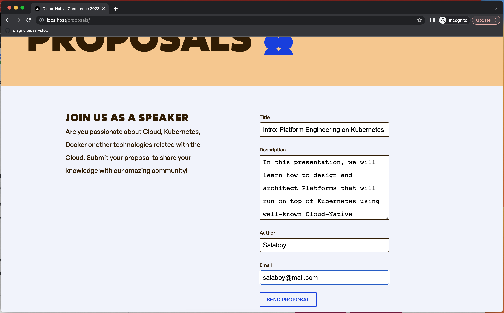
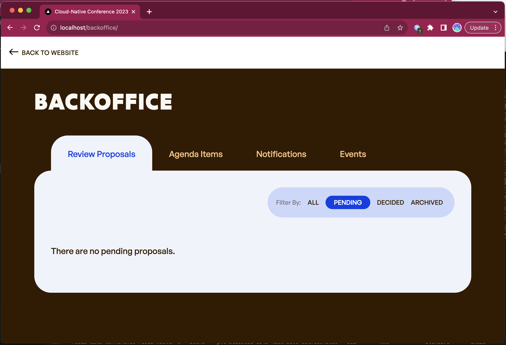
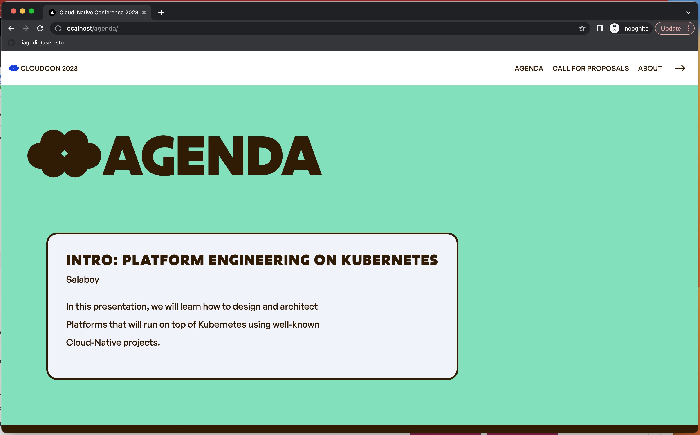
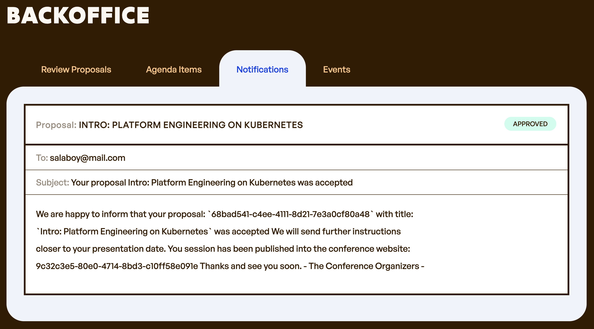
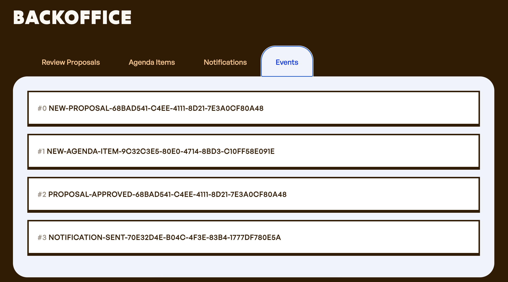

# 第一章：在 Kubernetes 基础上构建平台

## 示例：会议应用

书中使用了一个有一定复杂度的会议应用，可以用这个应用来测试工具和框架。当然，这不是一个足以交付给客户进行实际应用的完整产品。

该应用实现了一个非常简单的功能：演讲者可以在应用里提交议题，让会议组织者进行评审。

流程相当简单。潜在的使用者可以在点击 **Call for Proposals** 链接后，填写并提交议题。

会议组织者可以进入 **Backoffice** 链接，对新提交的议题进行评估，并做出采纳或拒绝的决定。

被采纳的议题会自动发布到会议日程（**Agenda**）页面。

在 **Backoffice**，**Notifications** 选项卡中会展示所有发送给潜在演讲者的采纳或者拒绝的通知邮件。

这个应用的每项操作都会产生事件。所以在提交新议题、采纳或拒绝议题以及发送通知时，应用程序前端都会发送并捕获事件。您可以在 **Backoffice** 的 **Events** 选项卡中查看这些事件。

## 其它的先决条件

本书教程所需的工具列表如下：

- [Docker](https://docs.docker.com/engine/install/)
    - 注：本书全部教程都是使用 Docker 测试的，但是这里并不强制使用 Docker，你也可以尝试使用 [Podman](https://podman.io/)。
- [kubectl](https://kubernetes.io/docs/tasks/tools/)
- [KinD](https://kind.sigs.k8s.io/docs/user/quick-start/)
- [Helm](https://helm.sh/docs/intro/install/)

## 总结与贡献

要改进这些教程，欢迎在 [Twitter](https://twitter.com/salaboy) 上联系我或者提交 PR。
