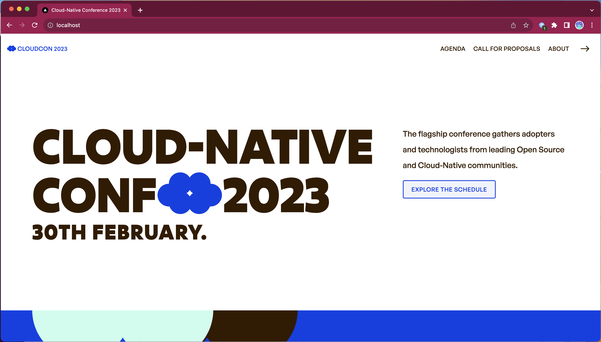

# Capítulo 2 :: Desafios da Aplicação Cloud Native

---
_🌍 Disponível em_: [English](README.md) | [中文 (Chinese)](README-zh.md) | [Português (Portuguese)](README-pt.md)

> **Nota:** Trago a você pela fantástica comunidade cloud-native e seus [ 🌟 contribuidores](https://github.com/salaboy/platforms-on-k8s/graphs/contributors)!

---

Neste tutorial, vamos instalar a `Conference Application` em um cluster Kubernetes KinD local, usando o Helm.

> [!NOTE]
> Os Helm Charts podem ser publicados em repositórios de Helm Chart ou, a partir da versão 3.7, como contêineres OCI em container registries.

## Criando um cluster local com o Kubernetes KinD

> [!Important]
> Certifique-se de ter os pré-requisitos para todos os tutoriais. Você pode encontrá-los [aqui](../chapter-1/README.md#pre-requisites-for-the-tutorials).

Utilize o comando abaixo para criar um Cluster KinD com três worker nodes e 1 Control Plane.

```shell
cat <<EOF | kind create cluster --name dev --config=-
kind: Cluster
apiVersion: kind.x-k8s.io/v1alpha4
nodes:
- role: control-plane
  kubeadmConfigPatches:
  - |
    kind: InitConfiguration
    nodeRegistration:
      kubeletExtraArgs:
        node-labels: "ingress-ready=true"
  extraPortMappings:
  - containerPort: 80
    hostPort: 80
    protocol: TCP
  - containerPort: 443
    hostPort: 443
    protocol: TCP
- role: worker
- role: worker
- role: worker
EOF
```

Uma vez que temos nosso cluster e nosso Ingress Controller instalados e configurados, podemos prosseguir com a instalação de nossa aplicação.

## Instalando a Conference Application

A partir do Helm 3.7+, podemos usar imagens OCI para publicar, baixar e instalar Helm Charts. Esta abordagem utiliza o Docker Hub como um registro (registry) para o Helm Chart.

Para instalar a Conference Application, você só precisa executar o seguinte comando:

```shell
helm install conference oci://docker.io/salaboy/conference-app --version v1.0.0
```

Você também pode executar o seguinte comando para ver os detalhes do chart:

```shell
helm show all oci://docker.io/salaboy/conference-app --version v1.0.0
```

Verifique se todos os pods da aplicação estão ativos e em execução.

> [!Note]
> Observe que, se sua conexão com a internet for lenta, pode levar algum tempo para a aplicação iniciar. Como os serviços da aplicação dependem de alguns componentes de infraestrutura (Redis, Kafka, PostgreSQL), esses componentes precisam iniciar e estarem prontos para que os serviços possam se conectar a eles.
>
> Componentes como o Kafka são bastante pesados, com cerca de 335+ MB, PostgreSQL 88+ MB e Redis 35+ MB.

Eventualmente, você deverá ver algo assim. Pode levar alguns minutos:

```shell
kubectl get pods
```

A coluna `RESTARTS` do Pod mostra que talvez o Kafka tenha demorado, e o serviço foi iniciado primeiro pelo Kubernetes, portanto, ele reiniciou para esperar que o Kafka estivesse pronto.

Agora, para acessar a aplicação, você pode abrir em seu navegador a seguinte URL [http://localhost](http://localhost).



------
## [Importante] Limpeza do ambiente - _!!! LEIA !!_

Como a Conference Application utiliza o PostgreSQL, Redis e Kafka, se você quiser remover e instalar a aplicação novamente (o que faremos à medida que avançamos nos guias), você precisa ter certeza de excluir os PersistenceVolumeClaims (PVCs) associados.

Esses PVCs são os volumes usados para armazenar os dados dos bancos de dados e do Kafka. Caso não exclua esses PVCs entre as instalações, o que acontecerá é que os serviços utilizarão as credenciais antigas para se conectar aos novos bancos de dados provisionados.

Você pode excluir todos os PVCs listando-os com:

```shell
kubectl get pvc
```

E depois deletando com:

```shell
kubectl delete pvc data-conference-kafka-0 data-conference-postgresql-0 redis-data-conference-redis-master-0
```

O nome dos PVCs mudará com base no nome do Helm Release que você usou ao instalar o chart.

Finalmente, se você quiser se livrar do Cluster KinD completamente, você pode executar:

```shell
kind delete clusters dev
```

-------
## Próximos Passos

Recomendo fortemente que você pratique com um Cluster Kubernetes real hospedado em um provedor de nuvem. Você pode experimentar a maioria dos provedores de nuvem, pois eles oferecem uma avaliação gratuita onde você pode criar Clusters Kubernetes e executar todos esses exemplos [verifique este repositório para mais informações](https://github.com/learnk8s/free-kubernetes).

Se você puder criar um Cluster em um provedor de nuvem e colocar o subir a aplicação, você ganhará experiência prática em todos os tópicos abordados no Capítulo 2.

## Resumo e Contribuição

Neste breve tutorial, conseguimos instalar o esqueleto da **Conference Application**. Vamos utilizar esta aplicação como exemplo ao longo dos demais capítulos. Certifique-se de que a aplicação funcione para você, pois ela abrange o básico do uso e interação com um Cluster Kubernetes.

Quer melhorar este tutorial? Crie uma [isue](https://github.com/salaboy/platforms-on-k8s/issues/new), mande-me uma mensagem no [Twitter](https://twitter.com/salaboy) ou envie um [Pull Request](https://github.com/salaboy/platforms-on-k8s/compare).
