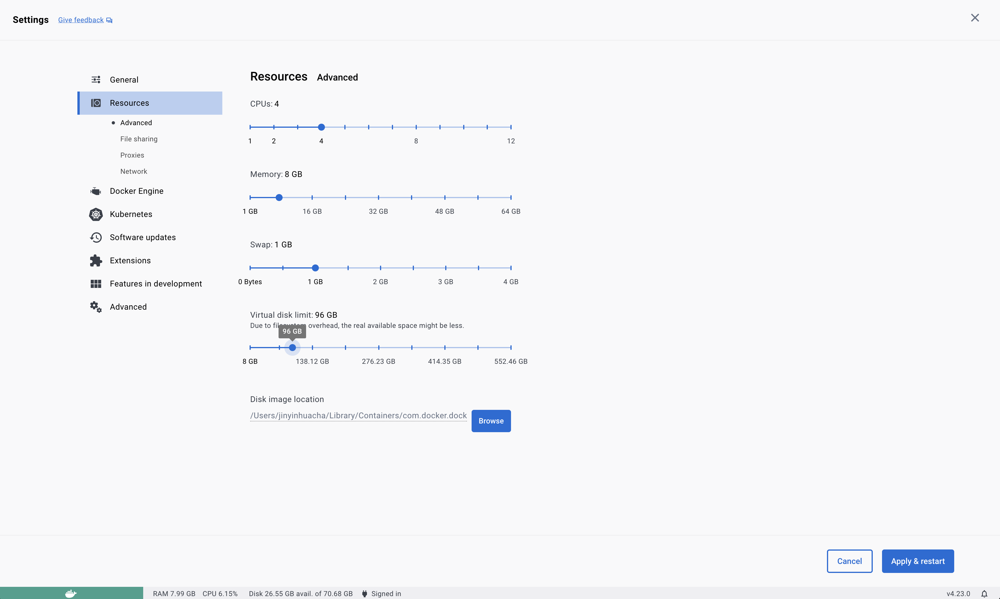

# Chapter 2 :: Cloud-Native Application Challenges

---
_🌍 Available in_: [English](README.md) | [中文 (Chinese)](README-zh.md) | [Português (Portuguese)](README-pt.md) 

> **Note:** Brought to you by the fantastic cloud-native community's [ 🌟 contributors](https://github.com/salaboy/platforms-on-k8s/graphs/contributors)!

In this short tutorial, we will be installing the `Conference Application` using Helm into a local KinD Kubernetes Cluster. 

> [!NOTE]
> Helm Charts can be published to Helm Chart repositories or also, since Helm 3.7, as OCI containers to container registries. 

## Creating a local cluster with Kubernetes KinD

> [!Important]
> Make sure you have the pre-requisites for all the tutorials. You can find them [here](../chapter-1/README.md#pre-requisites-for-the-tutorials).

Use the command below to create a KinD Cluster with three worker nodes and 1 Control Plane.

```shell
cat <<EOF | kind create cluster --name dev --config=-
kind: Cluster
apiVersion: kind.x-k8s.io/v1alpha4
nodes:
- role: control-plane
  kubeadmConfigPatches:
  - |
    kind: InitConfiguration
    nodeRegistration:
      kubeletExtraArgs:
        node-labels: "ingress-ready=true"
  extraPortMappings:
  - containerPort: 80
    hostPort: 80
    protocol: TCP
  - containerPort: 443
    hostPort: 443
    protocol: TCP
- role: worker
- role: worker
- role: worker
EOF

```


### Loading some container images before installing the application and other components

The `kind-load.sh` script prefetches, in other words, pulls and loads container images that we will use for our application to our KinD Cluster. 

The idea here is to optimize the process for our Cluster, so that when we install the application, we won't have to wait for 10+ minutes while all needed container images are being fetched. With all images already preloaded into our KinD cluster, the application should start in around 1 minute, which is the time needed for PostgreSQL, Redis and Kafka to bootstrap. 

Now, let's fetch the required images into our KinD cluster.

> [!Important]
> By running the script mentioned in next step, you will fetch all the required images and then load them into every node of your KinD cluster. If you are running the examples on a Cloud Provider, this might not be worth it as Cloud Providers with Gigabyte connections to container registries might fetch these images in a matter of seconds.

In your terminal, access the`chapter-2` directory, and from there, run the script: 

```shell
./kind-load.sh
```

> [!Note]
> If you are running Docker Desktop on MacOS and have set a smaller size for the virtual disk, you may encounter the following error:
>
> ```shell
> $ ./kind-load.sh
> ...
> Command Output: Error response from daemon: write /var/lib/docker/...
> /layer.tar: no space left on device
> ```
>
> You can modify the value of the Virtual Disk limit in the ``Settings -> Resources`` menu.
>   


### Installing NGINX Ingress Controller

We need the NGINX Ingress Controller to route traffic from our laptop to the services running inside the cluster. NGINX Ingress Controller acts as a router that is running inside the cluster but is also exposed to the outside world. 

```shell
kubectl apply -f https://raw.githubusercontent.com/kubernetes/ingress-nginx/release-1.8/deploy/static/provider/kind/deploy.yaml
```

Check that the pods inside the `ingress-nginx` are started correctly before proceeding: 
```shell
> kubectl get pods -n ingress-nginx
NAME                                        READY   STATUS      RESTARTS   AGE
ingress-nginx-admission-create-cflcl        0/1     Completed   0          62s
ingress-nginx-admission-patch-sb64q         0/1     Completed   0          62s
ingress-nginx-controller-5bb6b499dc-7chfm   0/1     Running     0          62s
```

This should allow you to route traffic from `http://localhost` to services inside the cluster. Notice that for KinD to work in this way, we provided extra parameters and labels for the control plane node when we created the cluster:
```yaml
nodes:
- role: control-plane
  kubeadmConfigPatches:
  - |
    kind: InitConfiguration
    nodeRegistration:
      kubeletExtraArgs:
        node-labels: "ingress-ready=true" #This allow the ingress controller to be installed in the control plane node
  extraPortMappings:
  - containerPort: 80 # This allows us to bind port 80 in local host to the ingress controller, so it can route traffic to services running inside the cluster.
    hostPort: 80
    protocol: TCP
  - containerPort: 443
    hostPort: 443
    protocol: TCP
```

Once we have our cluster and our Ingress Controller installed and configured, we can move ahead to install our application.


## Installing the Conference Application

From Helm 3.7+, we can use OCI images to publish, download, and install Helm Charts. This approach uses Docker Hub as a Helm Chart registry. 

To install the Conference Application, you only need to run the following command:

```shell
helm install conference oci://docker.io/salaboy/conference-app --version v1.0.0
```

You can also run the following command to see the details of the chart: 

```shell
helm show all oci://docker.io/salaboy/conference-app --version v1.0.0
```

Check that all the application pods are up and running. 

> [!Note]
> Notice that if your internet connection is slow, it might take a while for the application to start. Since the application's services depend on some infrastructure components (Redis, Kafka, PostgreSQL), these components need to start and be ready for the services to connect. 
> 
> Components like Kafka are quite heavy, with around 335+ MB, PostgreSQL 88+ MB, and Redis 35+ MB.

Eventually, you should see something like this. It can take a few minutes: 

```shell
kubectl get pods
NAME                                                           READY   STATUS    RESTARTS      AGE
conference-agenda-service-deployment-7cc9f58875-k7s2x          1/1     Running   4 (45s ago)   2m2s
conference-c4p-service-deployment-54f754b67c-br9dg             1/1     Running   4 (65s ago)   2m2s
conference-frontend-deployment-74cf86495-jthgr                 1/1     Running   4 (56s ago)   2m2s
conference-kafka-0                                             1/1     Running   0             2m2s
conference-notifications-service-deployment-7cbcb8677b-rz8bf   1/1     Running   4 (47s ago)   2m2s
conference-postgresql-0                                        1/1     Running   0             2m2s
conference-redis-master-0                                      1/1     Running   0             2m2s
```

The Pod `RESTARTS` column shows that maybe Kafka was slow, and the service was started first by Kubernetes, hence it restarted to wait for Kafka to be ready. 


Now you can point your browser to [http://localhost](http://localhost) to see the application. 


------
## [Important] Clean up - _!!! Must READ!!_

Because the Conference Application is installing PostgreSQL, Redis, and Kafka, if you want to remove and install the application again (which we will do as we move through the guides), you need to make sure to delete the associated PersistenceVolumeClaims (PVCs). 

These PVCs are the volumes used to store the data from the databases and Kafka. Failing to delete these PVCs in between installations will cause the services to use old credentials to connect to the new provisioned databases. 

You can delete all PVCs by listing them with:

```shell
kubectl get pvc
```

You should see:

```shell
NAME                                   STATUS   VOLUME                                     CAPACITY   ACCESS MODES   STORAGECLASS   AGE
data-conference-kafka-0                Bound    pvc-2c3ccdbe-a3a5-4ef1-a69a-2b1022818278   8Gi        RWO            standard       8m13s
data-conference-postgresql-0           Bound    pvc-efd1a785-e363-462d-8447-3e48c768ae33   8Gi        RWO            standard       8m13s
redis-data-conference-redis-master-0   Bound    pvc-5c2a96b1-b545-426d-b800-b8c71d073ca0   8Gi        RWO            standard       8m13s
```

And then delete with: 
```shell
kubectl delete pvc  data-conference-kafka-0 data-conference-postgresql-0 redis-data-conference-redis-master-0
```

The name of the PVCs will change based on the Helm Release name that you used when installing the chart.

Finally, if you want to get rid of the KinD Cluster entirely, you can run:

```shell
kind delete clusters dev
```

-------
## Next Steps

I strongly recommend you get your hands dirty with a real Kubernetes Cluster hosted in a Cloud Provider. You can try most Cloud Providers, as they offer a free trial where you can create Kubernetes Clusters and run all these examples [check this repository for more information](https://github.com/learnk8s/free-kubernetes). 

If you can create a Cluster in a Cloud provider and get the application up and running, you will gain real-life experience on all the topics covered in Chapter 2.

## Sum up and Contribute

In this short tutorial, we have managed to install the **Conference Application** walking skeleton. We will use this application as an example throughout the rest of the chapters. Make sure that this application works for you as it covers the basics of using and interacting with a Kubernetes Cluster.

Do you want to improve this tutorial? Create an [issue](https://github.com/salaboy/platforms-on-k8s/issues/new), message me on [Twitter](https://twitter.com/salaboy), or send a [Pull Request](https://github.com/salaboy/platforms-on-k8s/compare).
