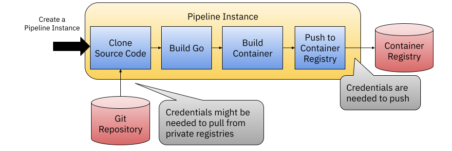

# Tekton in Action

本篇教程介绍了 Tekton 的安装以及创建简单任务和 Pipeline 的过程。

[Tekton](https://tekton.dev) 是一个专为云（特别是 Kubernetes）打造的流水线引擎。该引擎不会对其可以执行的任务类型施加任何限制，因此可以借助该引擎实现各种类型的流水线，以满足托管流水线无法满足的需求。

在首次运行 Tekton 流水线之后，本文还包括一个指向更复杂的流水线的链接，该流水线可以用于构建我们的会议应用服务。

## 部署 Tekton

下面的步骤会指导你在 Kubernetes 集群中部署和配置 Tekton。如果你没有 Kubernetes 集群，可以[用 Kind 创建 Kubernetes 集群](../../chapter-2/README.zh-cn.md)。

1. **部署 Tekton 流水线**

```
  kubectl apply -f https://storage.googleapis.com/tekton-releases/pipeline/previous/v0.45.0/release.yaml
```

1. **部署 Tekton 仪表盘（可选）**

```
kubectl apply -f https://github.com/tektoncd/dashboard/releases/download/v0.33.0/release.yaml
```

可以使用 `kubectl` 进行端口转发，来访问仪表盘。

```
kubectl port-forward svc/tekton-dashboard  -n tekton-pipelines 9097:9097
```


接下来可以用浏览器访问 [http://localhost:9097](http://localhost:9097)。

1. **部署 Tekton CLI（可选）**:

还可以安装 Tekton 的 [`tkn` 客户端工具](https://github.com/tektoncd/cli)。

在 Mac OSX 中可以运行如下命令完成安装：

```
brew install tektoncd-cli
```

## Tekton 任务入门

本节内容将指导你创建任务和一个简单的流水线，然后用流水线构建会议应用的制品。

在 Tekton 上可以定义任务，下面展示了一个最简单的任务定义：

```
apiVersion: tekton.dev/v1
kind: Task
metadata:
  name: hello-world-task
spec:
  params:
  - name: name
    type: string
    description: who do you want to welcome?
    default: tekton user
  steps:
    - name: echo
      image: ubuntu
      command:
        - echo
      args:
        - "Hello World: $(params.name)" 
```

这个 Tekton `Task` 使用了 `ubuntu` 镜像，并调用了镜像中的 `echo` 命令。这个 `Task` 还提供了一个名为 `name` 的参数，其中包含将会回显的内容。现在把 `Task` 任务提交到集群：

```
kubectl apply -f hello-world/hello-world-task.yaml
```

任务被提交给 Kubernetes 之后，只是把任务定义上传到集群，而不会被执行。流水线可以引用这些任务，并且被用户执行。

列出集群中可用的 `Task`：

```
> kubectl get tasks
NAME               AGE
hello-world-task   88s
```

要运行这个任务，可以创建一个 `TaskRun` 资源，该资源中包含了运行 `Task` 的指令。这里给任务指定了一个固定的任务名称（`hello-world-task-run-1`），并给 `name` 参数赋值。

```
apiVersion: tekton.dev/v1
kind: TaskRun
metadata:
  name: hello-world-task-run-1
spec:
  params: 
  - name: name
    value: "Building Platforms on top of Kubernetes reader!"
  taskRef:
    name: hello-world-task
```

把 `TaskRun` 资源提交给集群，启动任务：

```
kubectl apply -f hello-world/task-run.yaml
taskrun.tekton.dev/hello-world-task-run-1 created
```

`TaskRun` 对象创建之后，Tekton 流水线引擎就开始进行任务调度，在 Kuberentes 中创建执行任务所需的 Pod。在 `default` 命名空间中列出 Pod：

```
kubectl get pods
NAME                         READY   STATUS     RESTARTS   AGE
hello-world-task-run-1-pod   0/1     Init:0/1   0          2s
```

查看 `TaskRun` 的状态：

```
kubectl get taskrun
NAME                     SUCCEEDED   REASON      STARTTIME   COMPLETIONTIME
hello-world-task-run-1   True        Succeeded   66s         7s
```

可以根据日志来查看这个任务的运行记录：

```
kubectl logs -f hello-world-task-run-1-pod 
Defaulted container "step-echo" out of: step-echo, prepare (init)
Hello World: Building Platforms on top of Kubernetes reader!
```

接下来看看如何使用 Tekton 流水线把多个任务串接起来。

## Tekton 流水线入门

我们可以使用流水线把多个任务组装起来。可以复用前面定义的任务，也可以从 [Tekton Hub](https://hub.tekton.dev/) 获取更多任务定义。


在创建流水线之前，我们先从 Tekton Hub 安装一个 `wget` 任务：

```
kubectl apply -f https://raw.githubusercontent.com/tektoncd/catalog/main/task/wget/0.1/wget.yaml
```

你应该会看到：

```
task.tekton.dev/wget created
```

接下来我们用 `Hello World` 和 `wget` 任务连成一个流水线。这条流水线的定义中，会抓取一个文件，读取文件内容，并把内容用在前面定义的 `Hello World` 任务里。


流水线的定义如下：

```yaml
apiVersion: tekton.dev/v1
kind: Pipeline
metadata:
  name: hello-world-pipeline
  annotations:
    description: |
      Fetch resource from internet, cat content and then say hello
spec:
  results: 
  - name: message
    type: string
    value: $(tasks.cat.results.messageFromFile)
  params:
  - name: url
    description: resource that we want to fetch
    type: string
    default: ""
  workspaces:
  - name: files
  tasks:
  - name: wget
    taskRef:
      name: wget
    params:
    - name: url
      value: "$(params.url)"
    - name: diroptions
      value:
        - "-P"  
    workspaces:
    - name: wget-workspace
      workspace: files
  - name: cat
    runAfter: [wget]
    workspaces:
    - name: wget-workspace
      workspace: files
    taskSpec: 
      workspaces:
      - name: wget-workspace
      results: 
        - name: messageFromFile
          description: the message obtained from the file
      steps:
      - name: cat
        image: bash:latest
        script: |
          #!/usr/bin/env bash
          cat $(workspaces.wget-workspace.path)/welcome.md | tee /tekton/results/messageFromFile
  - name: hello-world
    runAfter: [cat]
    taskRef:
      name: hello-world-task
    params:
      - name: name
        value: "$(tasks.cat.results.messageFromFile)"
```

下载文件，读取内容然后使用前面定义的 `hello-world` 任务，打印文件的内容。有了弹性定义流水线的能力，在未来可以扩充流水线，根据需要对任务的输入输出进行进一步的处理。

在这个例子里，我们使用了来自 Tekton Hub 的 `wget` 任务，这个任务里，下载文件之后直接调用 `cat` 命令把文件内容保存到 Tekton Result 中，并在后续的 `hello-world-task` 中引用这一结果。

安装流水线定义：

```
kubectl apply -f hello-world/hello-world-pipeline.yaml
```
要运行流水线，创建一个 `PipelineRun` 资源就可以：

```yaml
apiVersion: tekton.dev/v1
kind: PipelineRun
metadata:
  name: hello-world-pipeline-run-1
spec:
  workspaces:
    - name: files
      volumeClaimTemplate: 
        spec:
          accessModes:
          - ReadWriteOnce
          resources:
            requests:
              storage: 1M 
  params:
  - name: url
    value: "https://raw.githubusercontent.com/salaboy/salaboy/main/welcome.md"
  pipelineRef:
    name: hello-world-pipeline
 
```

我们的任务需要下载文件并保存到文件系统里，这里使用了 Tekton Workspace 的概念，用于为 `PipelineRun` 提供存储空间。就和之前运行 `TaskRun` 的情况类似，可以为 `PipelineRun` 设置参数，用不同参数来运行流水线。

不管是 `PipelineRun` 还是 `TaskRun`，每次运行都会生成新的资源名称。如果要重复提交同一个资源，Kubernetes 会拒绝对已有资源进行变更。

运行流水线：

```
kubectl apply -f hello-world/pipeline-run.yaml
```

看看新建出来的 Pod：

```
> kubectl get pods
NAME                                         READY   STATUS        RESTARTS   AGE
affinity-assistant-ca1de9eb35-0              1/1     Terminating   0          19s
hello-world-pipeline-run-1-cat-pod           0/1     Completed     0          11s
hello-world-pipeline-run-1-hello-world-pod   0/1     Completed     0          5s
hello-world-pipeline-run-1-wget-pod          0/1     Completed     0          19s
```

每个 Task 都会创建一个 Pod，另外还有一个叫做 `affinity-assistant-ca1de9eb35-0` 的 Pod，它会确保这些 Pod 都创建在正确的加载了存储卷的节点上。

再看看 `TaskRun` 对象：

```
> kubectl get taskrun
NAME                                     SUCCEEDED   REASON      STARTTIME   COMPLETIONTIME
hello-world-pipeline-run-1-cat           True        Succeeded   109s        104s
hello-world-pipeline-run-1-hello-world   True        Succeeded   103s        98s
hello-world-pipeline-run-1-wget          True        Succeeded   117s        109s

```

当然，如果所有任务都成功了，`PipelineRune` 也会成功：

```
kubectl get pipelinerun
NAME                         SUCCEEDED   REASON      STARTTIME   COMPLETIONTIME
hello-world-pipeline-run-1   True        Succeeded   2m13s       114s
```

如果安装了 Tekton 仪表盘，还可以在仪表盘上查看运行状态：


## Tekton 流水线

真实世界里的流水线当然远比上述内容要复杂得多。实际的流水线通常会有更多配置，以及访问外部系统所需的凭据。

文件 [service-pipeline.yaml](service-pipeline.yaml) 中定义了一个示例流水线。



示例流水线中使用 `ko` 构建和发布应用的容器镜像。这个流水线是针对我们的 Golang 服务定制的，要使用不同的编程语言，就需要使用其它工具。这个示例流水线可以使用不同参数来构建不同的服务。

要运行这条流水线，首先设置登录容器镜像仓库所需的凭据，这样才能让流水线把容器镜像推送到 Docker Hub 或别的仓库之中。[官方文档]((https://tekton.dev/docs/how-to-guides/kaniko-build-push/#container-registry-authentication))中包含了在 Teckton 任务或流水线中进行容器镜像仓库认证的指导。

在本例中，我们使用 Docker Hub 凭据创建了一个 Kubernetes Secret：

```
kubectl create secret docker-registry docker-credentials --docker-server=https://index.docker.io/v1/ --docker-username=<your-name> --docker-password=<your-pword> --docker-email=<your-email>
```

然后我们会安装 `git-clone` 和 `ko` 任务：

```
kubectl apply -f https://raw.githubusercontent.com/tektoncd/catalog/main/task/git-clone/0.9/git-clone.yaml
kubectl apply -f https://raw.githubusercontent.com/tektoncd/catalog/main/task/ko/0.1/ko.yaml
```

把流水线安装到集群里面：

```
kubectl apply -f service-pipeline.yaml
```

然后我们就可以创建新的流水线实例，用来构建和发布我们的应用容器镜像了。下面的 `PipelineRun` 资源，通过配置参数来完成 `Notification` 服务的构建：

```yaml
apiVersion: tekton.dev/v1
kind: PipelineRun
metadata:
  name: service-pipeline-run-1
  annotations:
    kubernetes.io/ssh-auth: kubernetes.io/dockerconfigjson
spec:
  params:
  - name: target-registry
    value: docker.io/salaboy
  - name: target-service
    value: notifications-service
  - name: target-version 
    value: 1.0.0-from-pipeline-run
  workspaces:
    - name: sources
      volumeClaimTemplate: 
        spec:
          accessModes:
          - ReadWriteOnce
          resources:
            requests:
              storage: 100Mi 
    - name: docker-credentials
      secret:  
        secretName: docker-credentials
  pipelineRef:
    name: service-pipeline
```

把上述定义提交到集群，就会创建一个流水线的新实例：

```
kubectl apply -f service-pipeline-run.yaml
```

要把镜像推送到自己的镜像仓库里，要在 `spec.params` 这一节进行修改。例如把 `docker.io/salaboy` 替换成你自己的镜像仓加名字。`target-service` 参数允许你选择要构建的服务（`notifications-service`、`agenda-service`、`c4p-service` 和 `frontend`）。


安装 Helm Chart 流水线：

```
kubectl apply -f app-helm-chart-pipeline.yaml
```

然后可以用 `PipelinRun` 来运行这条流水线：

```yaml
apiVersion: tekton.dev/v1
kind: PipelineRun
metadata:
  name: app-helm-chart-pipeline-run-1
  annotations:
    kubernetes.io/ssh-auth: kubernetes.io/dockerconfigjson
spec:
  params:
  - name: target-registry
    value: docker.io/salaboy
  - name: target-version
    value: v0.9.9
  workspaces:
    - name: sources
      volumeClaimTemplate: 
        spec:
          accessModes:
          - ReadWriteOnce
          resources:
            requests:
              storage: 100Mi 
    - name: dockerconfig
      secret:  
        secretName: docker-credentials
  pipelineRef:
    name: app-helm-chart-pipeline
```

将上述对象提交到集群，会创建一个新的 Helm Chart 流水线的实例：


```
kubectl apply -f app-helm-chart-pipeline-run.yaml
```

注意，Helm Chart 流水线使用的还是之前定义的 `docker-credentials`，它使用 OCI 容器镜像的格式将 Helm Chart 推送到镜像仓库。流水线中定义了 `target-version` 参数，在打包和推送之前，这个参数会被补丁到 `Chart.yaml` 文件里。注意在这个流水线里并没有对 Chart 中引用的容器镜像的版本做出修改，这就要求读者要自行设计参数，来指定每个服务的镜像版本，并确保相应版本的镜像已经推送到了镜像仓库。

**注意**：这里介绍的流水线都只是示例，用于演示 Tekton 中如何通过流水线配置来构建和推送镜像以及 Chart 的。例如 Helm Chart 流水线中没有对 Chart 版本或者容器镜像版本进行定义。如果我们要自动化完成所有步骤，可以从 Git tag 中读取内容，以这个内容作为镜像版本。

## 清理

如果要删除前面过程中创建的 Kind 集群，请运行如下命令：

```
kind delete clusters dev
```