# 使用 GitOps 管理环境

本教程中会使用 [ArgoCD](https://argo-cd.readthedocs.io/en/stable/) 来设置 Staging（预生产）环境。我们将用这个环境来承载会议应用的一个实例。

我们将从一个 Git 仓库中获取预生产环境的的配置。[`argo-cd/staging`](argo-cd/staging/) 目录包含了一个 Helm Chart，这个 Chart 会被同步到多个 Kubernetes 集群。

## 先决条件

- 需要一个 Kubernetes 集群，可以使用 [Kind](https://kind.sigs.k8s.io/) 来创建这个集群。
- 根据[官方文档](https://argo-cd.readthedocs.io/en/stable/getting_started/)，在集群中安装 ArgoCD。也可以选择安装 ArgoCD 的 CLI 客户端。
- 环境配置保存在 `chapter-4/argo-cd/staging/` 目录中，如果要修改环境的配置，需要 `Fork/Copy` [代码仓库](http://github.com/salaboy/platforms-on-k8s/)。

启动了包含 NGINX Ingress 控制器的 Kubernetes 集群之后，就可以安装 ArgoCD 了：

```
kubectl create namespace argocd
kubectl apply -n argocd -f https://raw.githubusercontent.com/argoproj/argo-cd/stable/manifests/install.yaml
```

你会看到类似下面的输出内容：

```
> kubectl create namespace argocd
kubectl apply -n argocd -f https://raw.githubusercontent.com/argoproj/argo-cd/stable/manifests/install.yaml
namespace/argocd created
customresourcedefinition.apiextensions.k8s.io/applications.argoproj.io created
customresourcedefinition.apiextensions.k8s.io/applicationsets.argoproj.io created
customresourcedefinition.apiextensions.k8s.io/appprojects.argoproj.io created
serviceaccount/argocd-application-controller created
serviceaccount/argocd-applicationset-controller created
serviceaccount/argocd-dex-server created
serviceaccount/argocd-notifications-controller created
serviceaccount/argocd-redis created
serviceaccount/argocd-repo-server created
serviceaccount/argocd-server created
role.rbac.authorization.k8s.io/argocd-application-controller created
role.rbac.authorization.k8s.io/argocd-applicationset-controller created
role.rbac.authorization.k8s.io/argocd-dex-server created
role.rbac.authorization.k8s.io/argocd-notifications-controller created
role.rbac.authorization.k8s.io/argocd-server created
clusterrole.rbac.authorization.k8s.io/argocd-application-controller created
clusterrole.rbac.authorization.k8s.io/argocd-server created
rolebinding.rbac.authorization.k8s.io/argocd-application-controller created
rolebinding.rbac.authorization.k8s.io/argocd-applicationset-controller created
rolebinding.rbac.authorization.k8s.io/argocd-dex-server created
rolebinding.rbac.authorization.k8s.io/argocd-notifications-controller created
rolebinding.rbac.authorization.k8s.io/argocd-redis created
rolebinding.rbac.authorization.k8s.io/argocd-server created
clusterrolebinding.rbac.authorization.k8s.io/argocd-application-controller created
clusterrolebinding.rbac.authorization.k8s.io/argocd-server created
configmap/argocd-cm created
configmap/argocd-cmd-params-cm created
configmap/argocd-gpg-keys-cm created
configmap/argocd-notifications-cm created
configmap/argocd-rbac-cm created
configmap/argocd-ssh-known-hosts-cm created
configmap/argocd-tls-certs-cm created
secret/argocd-notifications-secret created
secret/argocd-secret created
service/argocd-applicationset-controller created
service/argocd-dex-server created
service/argocd-metrics created
service/argocd-notifications-controller-metrics created
service/argocd-redis created
service/argocd-repo-server created
service/argocd-server created
service/argocd-server-metrics created
deployment.apps/argocd-applicationset-controller created
deployment.apps/argocd-dex-server created
deployment.apps/argocd-notifications-controller created
deployment.apps/argocd-redis created
deployment.apps/argocd-repo-server created
deployment.apps/argocd-server created
statefulset.apps/argocd-application-controller created
networkpolicy.networking.k8s.io/argocd-application-controller-network-policy created
networkpolicy.networking.k8s.io/argocd-applicationset-controller-network-policy created
networkpolicy.networking.k8s.io/argocd-dex-server-network-policy created
networkpolicy.networking.k8s.io/argocd-notifications-controller-network-policy created
networkpolicy.networking.k8s.io/argocd-redis-network-policy created
networkpolicy.networking.k8s.io/argocd-repo-server-network-policy created
networkpolicy.networking.k8s.io/argocd-server-network-policy created
```

要访问 ArgoCD 页面，在新的终端窗口中输入：

```
kubectl port-forward svc/argocd-server -n argocd 8080:443
```

**注意**：要等到 ArgoCD Pod 启动成功才能进行这些操作。因为要拉取容器镜像，第一次启动可能会比较慢。

使用浏览器访问 [http://localhost:8080](http://localhost:8080) 就能看到 ArgoCD 的页面了。

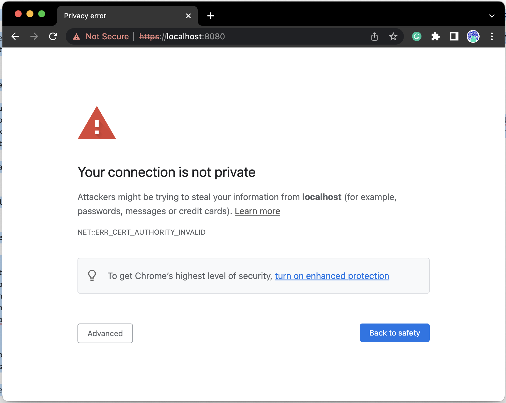

**注意**：默认安装会使用 HTTP 而非 HTTPS，因此如果看到了证书问题，请接受警告继续访问。

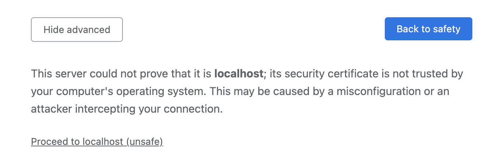

接下来会看到登录页面：

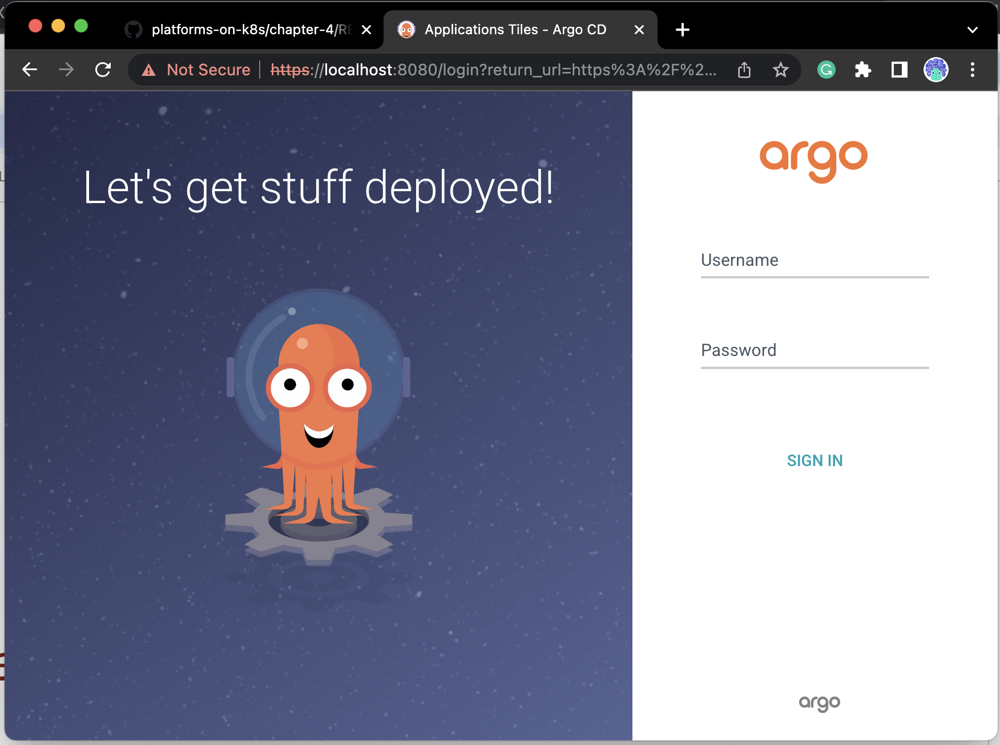

管理员用户名为 `admin`，运行下面的命令，就能获取到登录密码：

```
kubectl -n argocd get secret argocd-initial-admin-secret -o jsonpath="{.data.password}" | base64 -d; echo
```

登录成功后，就会看到空白的主页：

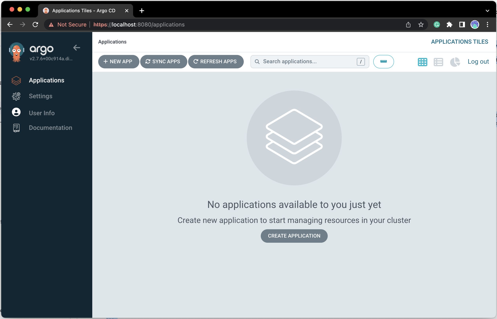

接下来我们开始部署我们的预生产环境。

## 在预生产环境中设置应用

在本教程中，我们会用一个命名空间来表示我们的预生产环境。我们也可以使用一个独立的集群来承载预生产环境。

首先我们给这个与生产环境创建一个命名空间：

```
kubectl create ns staging
```

你会看到下面的输出：

```
> kubectl create ns staging
namespace/staging created
```

**注意**：在 ArgoCD 创建应用的过程中，可以使用 `Auto Create Namespace` 的选项自动创建命名空间。


点击 **"+ New App"** 按钮，在后续的详情页面中对项目进行配置：

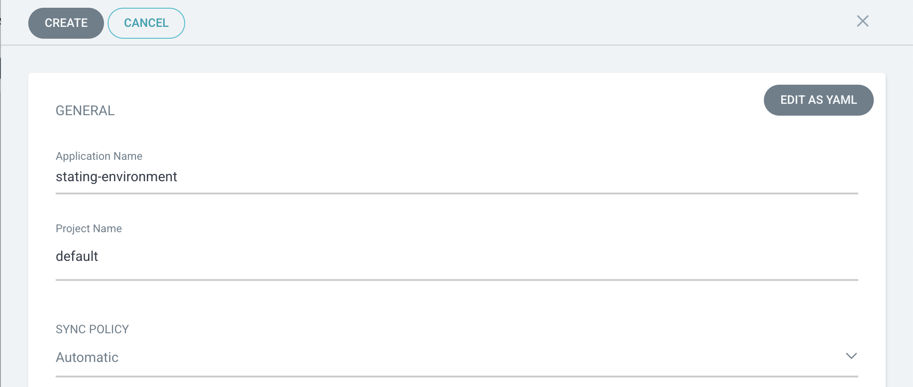

使用如下信息创建应用：

- Application Name: "staging-environment"
- Project: "default"
- Sync Policy: "Automatic"
- Source Repository: [https://github.com/salaboy/platforms-on-k8s](https://github.com/salaboy/platforms-on-k8s) (here you can point to your fork)
- Revision: "HEAD"
- Path: "chapter-4/argo-cd/staging/"
- Cluster: "https://kubernetes.default.svc" 
- Namespace: "staging"

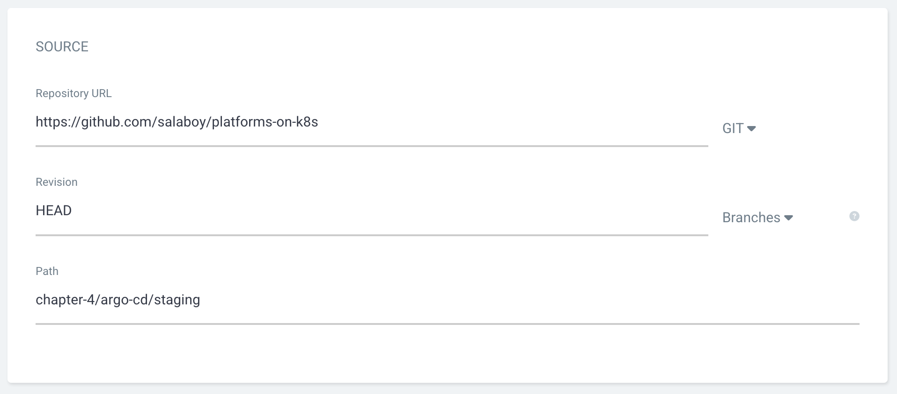

其它值可以保持默认，然后点击顶部的 **Create** 按钮：

因为我们选择了 **Automatic** 模式，页面上会自动同步创建过程：

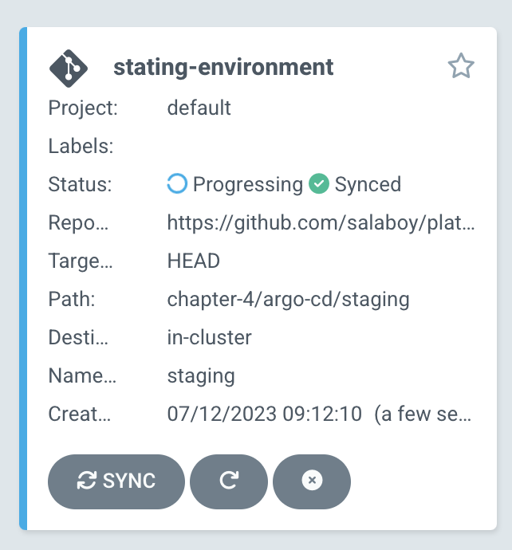

点击 App，会展开呈现所有被创建的资源：

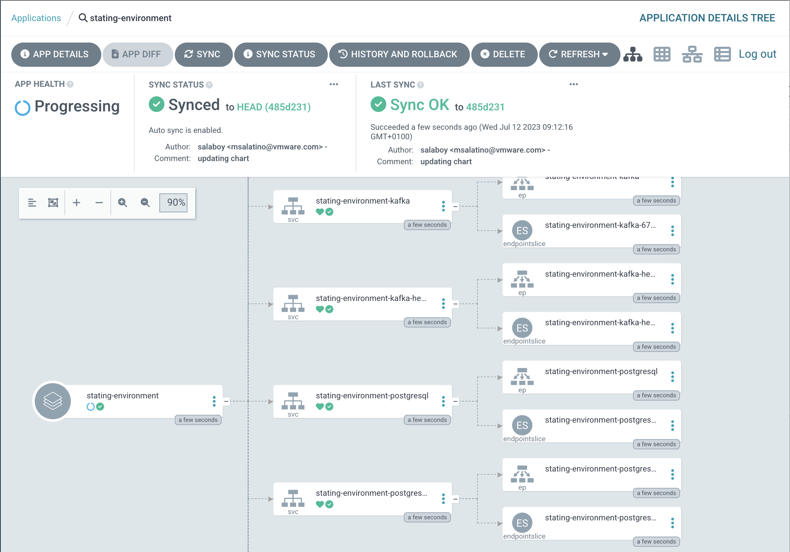

如果是在本地环境中运行的，可以使用端口转发的方式来访问应用，在新的终端窗口中运行：

```
kubectl port-forward svc/frontend -n staging 8081:80
```

等待应用启动成功后，就可以用浏览器打开 [http://localhost:8081](http://localhost:8081)，访问应用页面：


当然，我们还是可以使用 `kubectl` 来查看 Pod 和 Service 的状态。一定程度上，Pod 状态反映了应用的运行状态：

```
kubectl get pods -n staging
```

你会看到类似这样的输出：

```
> kubectl get pods -n staging
NAME                                                              READY   STATUS    RESTARTS        AGE
stating-environment-agenda-service-deployment-6c9cbb9695-xj99z    1/1     Running   5 (6m ago)      8m4s
stating-environment-c4p-service-deployment-69d485ffd8-q96z4       1/1     Running   5 (5m52s ago)   8m4s
stating-environment-frontend-deployment-cd76bdc8c-58vzr           1/1     Running   5 (6m3s ago)    8m4s
stating-environment-kafka-0                                       1/1     Running   0               8m4s
stating-environment-notifications-service-deployment-5c9b5bzb5p   1/1     Running   5 (6m13s ago)   8m4s
stating-environment-postgresql-0                                  1/1     Running   0               8m4s
stating-environment-redis-master-0                                1/1     Running   0               8m4s
```

**注意**：这里可能会看到有重新启动，这是正常的，原因是应用在等待依赖设施（Redis、PostgreSQL、Kafka）的启动.

## 修改预生产环境中的应用配置

修改 [staging](staging/) 目录中的 [Chart.yaml](argo-cd/staging/Chart.yaml) 或者 [values.yaml](argo-cd/staging/values.yaml)，就能更改服务的版本配置。

在本例中，可以更新 ArgoCD 中的应用细节和参数，来修改应用的配置。

我们在模拟一种场景，修改预生产环境所在的 Github 仓库。

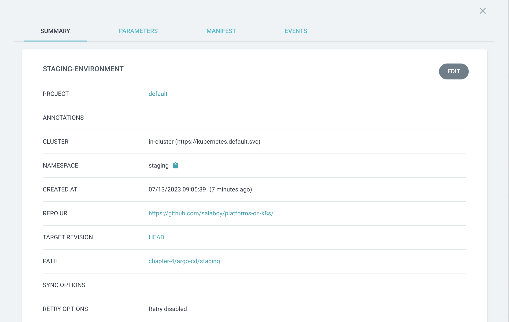

编辑应用程序详细信息/参数，并选择 `values-debug-enabled.yaml` 作为我们要用于此应用程序的值文件。该文件将调试标志设置到前端服务中，一次模拟我们对原始 `values.yaml` 文件的更改。

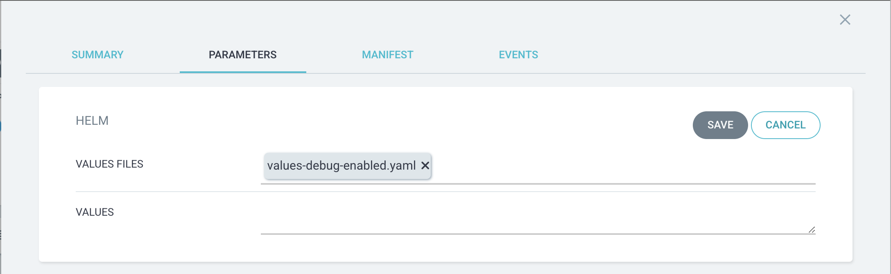

这样一来，前端服务的 Pod 会被新新配置所替换，所以我们要重新打开端口转发：

```
kubectl port-forward svc/frontend -n staging 8081:80
```

前端启动运行之后，就可以看到 Backoffice 中的 Debug 标签页了：

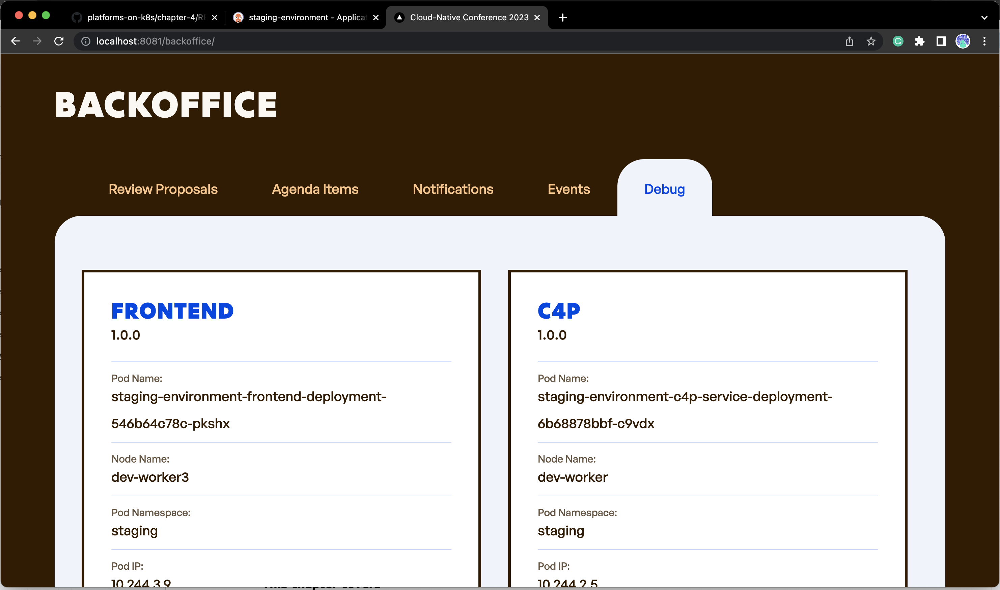

## 清理

可以用如下命令清理 Kind 创建的集群：

```
kind delete clusters dev
```

## 下一步

ArgoCD 只是 GitOps 工具中的一个，你能用 Flux CD 复制这个教程吗？你更喜欢哪一个？贵组织是否已经在使用 GitOps 工具？如何使用该工具将会议应用部署到 Kubernetes 集群？

或者新建一个环境，例如 `production-environment`，并描述新发布的 `notifications-service` 从预生产环境到生产环境的流程？生产环境配置存储在哪里？

## 总结和贡献

在本教程中我们用 ArgoCD 创建了一个预生产环境。我们把 Github 仓库中的配置同步到 Kubernetes 集群之中。如果变更了 Github 仓库中的内容，并刷新 ArgoCD，ArgoCD 会在每次发现变更之后，把变更同步到环境之中。如果我们使用的是自动同步策略，ArgoCD 会自动发现配置变更并进行同步。在 [ArgoCD 网站](https://argo-cd.readthedocs.io/en/stable/)或者[我的博客](https://www.salaboy.com)上有更多的相关信息。

要改进这些教程，欢迎在 [Twitter](https://twitter.com/salaboy) 上联系我或者提交 PR。
