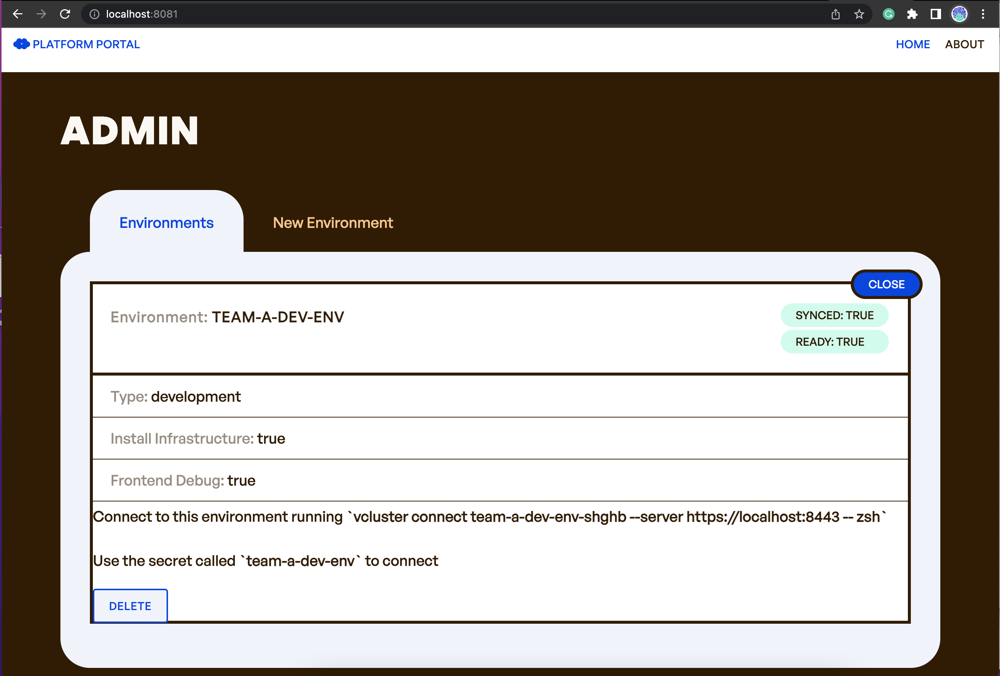

# 在 Kubernetes 基础上构建平台工程
---
_🌍 Available in_: [English](README.md)

> **Note:** Brought to you by the fantastic cloud-native community's [ 🌟 contributors](https://github.com/salaboy/platforms-on-k8s/graphs/contributors)!

---

本章内容将会通过复用 Kubernetes API 的方式来创建我们平台的 API。平台要为开发者解决的第一个问题就是用自助的方式创建新的开发环境。

我们会使用 Crossplane 和 `vcluster` 这两个 CNCF 开源项目。

## 安装

要有一个 Kubernetes 集群才能安装 Crossplane，可以按照[第二章](../chapter-2/README-zh.md)提到的步骤使用 Kind 创建集群。

然后按照[第五章](../chapter-5/README-zh.md)的介绍，部署 Crosspllane 和 Crossplane 的 Helm Provider。

后面的内容将会使用 [`vcluster`](https://www.vcluster.com/)，但是其实不需要在集群中进行任何操作。只需要安装一个 `vcluster` 客户端来连接到我们的 `vcluster` 即可。可以遵照[官网教程](https://www.vcluster.com/docs/getting-started/setup)完成安装

## 定义环境 API

这里说的环境，代表的是一个 Kubernetes 集群，我们将会把会议应用部署在这里。这样研发团队就能用这个自助的环境来完成工作了。

本文中我们会定义一个环境 API，以及一个使用 Helm Provider 的 Crossplane Composition，来创建一个 `vcluster` 的新实例，配置文件包含在 [resources/composition-devenv.yaml](resources/composition-devenv.yaml#L24) 里。创建新的 `vcluster` 之后，Composition 会使用 Helm Provider 把我们的会议应用安装在新建的 `vcluster` 里，代码保存在 [resources/composition-devenv.yaml](resources/composition-devenv.yaml#L117) 里。

运行下面的命令来部署 XRD 和 Composition：

```shell
kubectl apply -f resources/
```

你会看到：

```shell
composition.apiextensions.crossplane.io/dev.env.salaboy.com created
compositeresourcedefinition.apiextensions.crossplane.io/environments.salaboy.com created
```

有了环境和 Crossplane Composition，开发团队就可以按需申请环境了。

## 申请新环境

研发团队创建一个如下请求就可以申请新环境：

```yaml
apiVersion: salaboy.com/v1alpha1
kind: Environment
metadata:
  name: team-a-dev-env
spec:
  compositionSelector:
    matchLabels:
      type: development
  parameters: 
    installInfra: true
    
```

提交到集群之后，Crossplane Composition 就会创建新的 `vcluster`，其中包含了一个会议应用的实例。

```shell
kubectl apply -f team-a-dev-env.yaml
```

你会看到如下输出：

```shell
environment.salaboy.com/team-a-dev-env created
```

可以使用如下命令查看环境状态：

```shell
> kubectl get env
NAME             CONNECT-TO             TYPE          INFRA   DEBUG   SYNCED   READY   CONNECTION-SECRET   AGE
team-a-dev-env   team-a-dev-env-jp7j4   development   true    true    True     False   team-a-dev-env      1s

```

以下命令可以用来检查 Crossplane 是否正在创建和管理 Compostion 相关的 资源：


```shell
> kubectl get managed
NAME                            CHART            VERSION          SYNCED   READY   STATE      REVISION   DESCRIPTION        AGE
team-a-dev-env-jp7j4-8lbtj      conference-app   v1.0.0           True     True    deployed   1          Install complete   57s
team-a-dev-env-jp7j4-vcluster   vcluster         0.15.0-alpha.0   True     True    deployed   1          Install complete   57s
```

看看这些 Helm Release 类型的资源：

```shell
kubectl get releases
NAME                            CHART            VERSION          SYNCED   READY   STATE      REVISION   DESCRIPTION        AGE
team-a-dev-env-jp7j4-8lbtj      conference-app   v1.0.0           True     True    deployed   1          Install complete   45s
team-a-dev-env-jp7j4-vcluster   vcluster         0.15.0-alpha.0   True     True    deployed   1          Install complete   45s
```

然后我们连接到新环境（使用 vcluster 名字中的 connect-to 列）：

```shell
vcluster connect team-a-dev-env-jp7j4 --server https://localhost:8443 -- zsh
```

`vcluster` 模拟了一个不同的 Kubernetes 集群，所以如果要列出所有命名空间，会看到：

```shell
kubectl get ns
NAME              STATUS   AGE
default           Active   64s
kube-system       Active   64s
kube-public       Active   64s
kube-node-lease   Active   64s
```

如你所见，这里没有安装 Crossplane。列出所有 Pod：

```shell
NAME                                                              READY   STATUS    RESTARTS      AGE
conference-app-kafka-0                                            1/1     Running   0             103s
conference-app-postgresql-0                                       1/1     Running   0             103s
conference-app-c4p-service-deployment-57d4ddcd68-45f6h            1/1     Running   2 (99s ago)   104s
conference-app-agenda-service-deployment-9bf7946c9-mmx8h          1/1     Running   2 (98s ago)   104s
conference-app-redis-master-0                                     1/1     Running   0             103s
conference-app-frontend-deployment-c8c64c54d-lntnw                1/1     Running   2 (98s ago)   104s
conference-app-notifications-service-deployment-64ff7bcdf8nbvhl   1/1     Running   3 (80s ago)   104s
```

使用端口转发方式访问应用页面：

```shell
kubectl port-forward svc/frontend 8080:80
```

这样就可以浏览 [http://localhost:8080](http://localhost:8080) 的应用页面了。

使用 `exit` 命令来退出 vcluster 上下文。

## 简化平台界面

针对平台 API 进行进一步的简化，拒绝开发团队访问平台所在集群，并免除开发团队访问 Kubernetes API 的需要。

我们要部署一个管理界面，让团队能在 Web 页面上或者用 REST API 申请新环境。

在部署管理界面之前，需要确保当前没有在 `vcluster` 上下文之中（可以用 `exit` 命令退出 vcluster 上下文）。确定当前集群的一个方法是看看当前集群里有没有包含 `crossplane-system` 命名空间。

使用 Helm 安装管理界面：

```shell
helm install admin oci://docker.io/salaboy/conference-admin --version v1.0.0
```

安装成功之后，使用端口转发来访问管理界面：

```shell
kubectl port-forward svc/admin 8081:80
```

这样一来，开发团队就可以使用这样的简单界面来创建环境了。环境创建成功之后，可以使用 `vcluster` 命令连接到环境。



有了这个简易页面，开发团队就能直接使用过平台工具（Crossplane 和 Argo CD），无需 Kubernetes API 了。

除了用户界面之外，这个平台管理服务还提供了一组简单的 RESTFUL 接口，这样你就可以摆脱 Kubernetes 直接定义资源了。例如我们可以用下面的 JSON 创建新环境：

```json
{
    "name": "team-curl-dev-env",
    "parameters":{
        "type": "development",
        "installInfra": true,
        "frontend":{
            "debug": true
        }
    }
}
```

使用 `curl` 就可以完成任务：

```shell
curl -X POST -H "Content-Type: application/json" -d @team-a-dev-env-simple.json http://localhost:8081/api/environments/
```

列出所有环境：

```shell
curl localhost:8081/api/environments/
```

删除环境：

```shell
curl -X DELETE http://localhost:8081/api/environments/team-curl-dev-env
```

这个应用在 Kubernetes 和外部世界之间建起了桥梁。组织可能希望尽早建立这种抽象（应用程序接口），这样平台团队就可以对工具和工作流程决策进行调整。

## 清理

可以用如下命令清理 Kind 创建的集群：

```
kind delete clusters dev
```

## 下一步

第五章中的数据库和消息中间件，是不是也可以在管理界面中创建出来呢？这并不难，只是编写一个组件，在 Kubernetes API 基础之上构建一个面向用户的简化的接口即可。

根据实际需求，还可以创建一个 Compositon 来创建真正的集群来代替 `vcluster`。

要用真实集群代替 Kind 集群，需要做些什么呢？

## 总结和贡献

在本教程中，我们在使用 Kubernetes 资源模型基础上构建了一个新的平台 API，用来按需配置开发环境。我们还创建了一个简化层，无需团队学习 Kubernetes 的工作原理或底层细节、项目和技术，就能实现相同的功能。

通过依赖定义（在本例中为环境资源定义），平台团队可以根据自己的需求和可用工具，灵活地用不同策略和方法来进行环境供给。

要改进这些教程，欢迎在 [Twitter](https://twitter.com/salaboy) 上联系我或者提交 PR。
