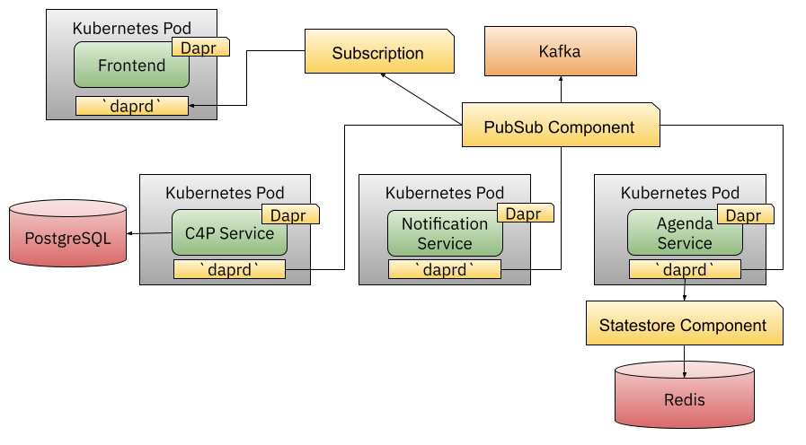
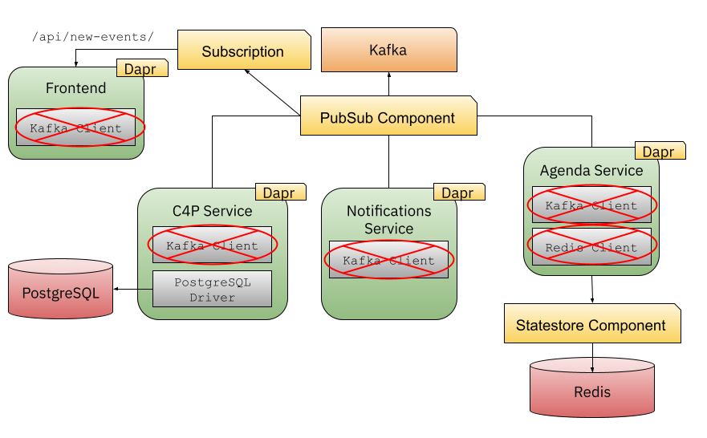
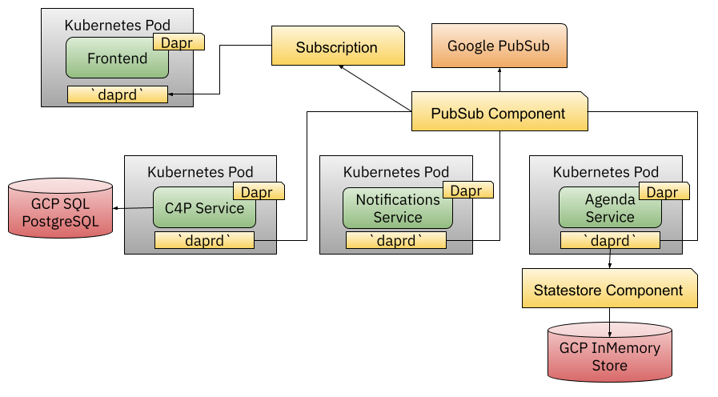
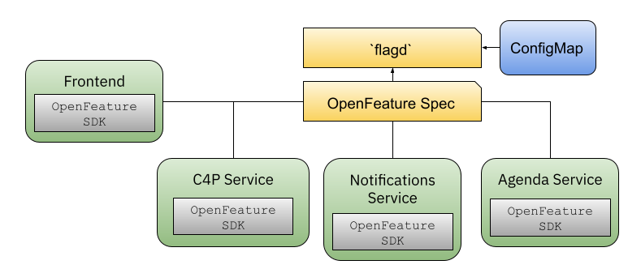
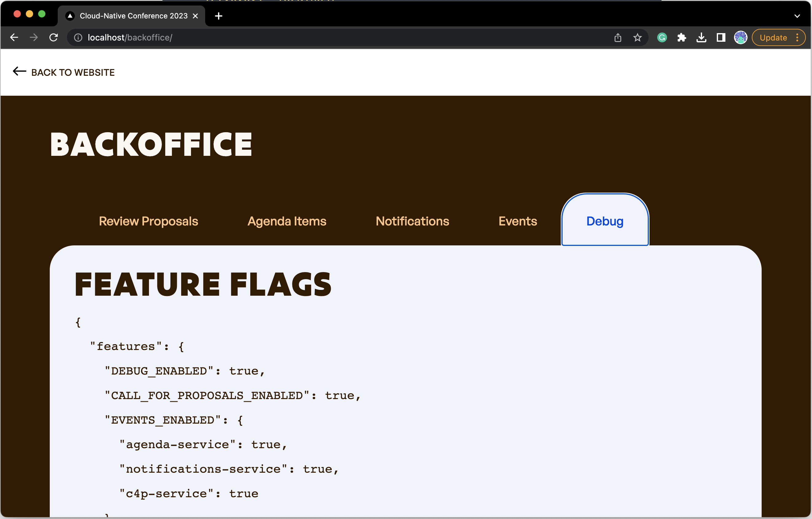
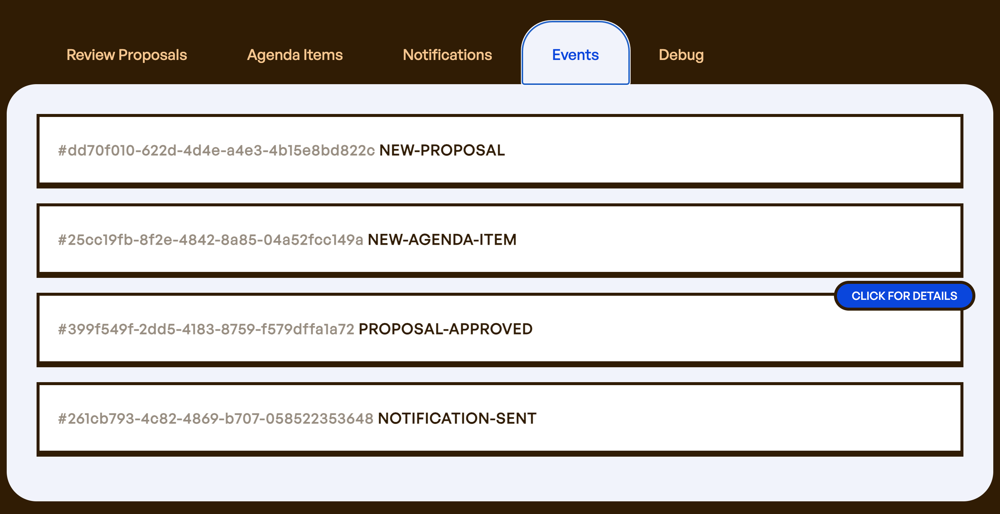
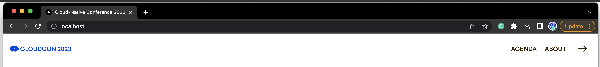

# 应用级 API 和特性开关

---
_🌍 Available in_: [English](README.md)

> **Note:** Brought to you by the fantastic cloud-native community's [ 🌟 contributors](https://github.com/salaboy/platforms-on-k8s/graphs/contributors)!

---

本文中，我们会尝试使用 [Dapr](https://dapr.io) 来提供应用级的 API，来解决多数应用程序都存在的普遍问题。

然后再看看 [OpenFeature](https://openfeature.dev) 项目。这个项目视图对特性开关进行标准化，应用开发团队可以持续推出新特性，而运营方则可以决定何时开启或关闭这些特性。

两个项目都致力于让开发者通过变更代码的方式来提供新的 API 和工具，因此我们需要部署一个新的应用版本（`v2.0.0`）。可以通过[版本对比](https://github.com/salaboy/platforms-on-k8s/compare/v2.0.0)的方式来了解这一版本的不同。

## 部署

要有一个 Kubernetes 集群来安装 [Dapr](https://dapr.io) 和 [Flagd](https://openfeature.dev/) Provider。可以按照[第二章](chapter-2/README.zh.md)介绍的方法部署 Kind 集群。

有了 Kubernetes 集群之后，就可以用下面的命令在集群里安装 Dapr 了：

```shell
helm repo add dapr https://dapr.github.io/helm-charts/
helm repo update
helm upgrade --install dapr dapr/dapr \
--version=1.11.0 \
--namespace dapr-system \
--create-namespace \
--wait

```

Dapr 安装成功之后，我们就可以安装包含了 Dapr 和 FeatureFlag 特性的 `v2.0.0` 版本： 

## 运行 v2.0.0

接下来安装应用的 2.0.0 版本：

```shell
helm install conference oci://docker.io/salaboy/conference-app --version v2.0.0
```

这个版本的 Helm Chart 跟 `v1.0.0` 一样，包含了应用所需的基础设施（PostgreSQL、Redis 以及 Kafka）。服务会通过 Dapr API 和 Redis 和 Kafka 进行交互。这个版本还会使用 `flagd` 来提供 OpenFeature 支持。

## 使用 Dapr 实现应用 API

在 `v2.0.0` 中，如果你列出应用 Pod，你会发现每个服务（Agenda、C4P、Frontend 和 Notifications）都带了 Dapr Sidecar（`daprd`）：

```shell
> kubectl get pods
NAME                                                           READY   STATUS    RESTARTS      AGE
conference-agenda-service-deployment-5dd4bf67b-qkctd           2/2     Running   7 (7s ago)    74s
conference-c4p-service-deployment-57b5985757-tdqg4             2/2     Running   6 (19s ago)   74s
conference-frontend-deployment-69d9b479b7-th44h                2/2     Running   2 (68s ago)   74s
conference-kafka-0                                             1/1     Running   0             74s
conference-notifications-service-deployment-7b6cbf965d-2pdkh   2/2     Running   6 (42s ago)   74s
conference-postgresql-0                                        1/1     Running   0             74s
conference-redis-master-0                                      1/1     Running   0             74s
flagd-6bbdc5d999-c42wk                                         1/1     Running   0             74s
```

这里还看到了 `flagd` 容器也在运行，后面我们会解释他的问题。

在 Dapr 的视角来看，应用看上去是这样的：



Dapr Sidecar 暴露了 Dapr 组件 API，让应用可以和 `StateStore`（Redis）以及 `PubSub`（Kafka）API 进行通信：

运行命令查看一下 Dapr 组件：

```shell
> kubectl get components
NAME                                   AGE
conference-agenda-service-statestore   30m
conference-conference-pubsub           30m
```

使用 `describe` 命令查看每个组件的配置：

```shell
> kubectl describe component conference-agenda-service-statestore
Name:         conference-agenda-service-statestore
Namespace:    default
Labels:       app.kubernetes.io/managed-by=Helm
Annotations:  meta.helm.sh/release-name: conference
              meta.helm.sh/release-namespace: default
API Version:  dapr.io/v1alpha1
Auth:
  Secret Store:  kubernetes
Kind:            Component
Metadata:
  Creation Timestamp:  2023-07-28T08:26:55Z
  Generation:          1
  Resource Version:    4076
  UID:                 b4674825-d298-4ee3-8244-a13cdef8d530
Spec:
  Metadata:
    Name:   keyPrefix
    Value:  name
    Name:   redisHost
    Value:  conference-redis-master.default.svc.cluster.local:6379
    Name:   redisPassword
    Secret Key Ref:
      Key:   redis-password
      Name:  conference-redis
  Type:      state.redis
  Version:   v1
Events:      <none>

```

你会看到 `Statestore` 组件通过 `conference-redis-master.default.svc.cluster.local` 的服务名称，以及 `conference-redis` Secret 中的凭据连接到了 Redis 示例之中。

类似的，Dapr 的 `PubSub` 组件连接到了 Kafka：

```shell
kubectl describe component conference-conference-pubsub 
Name:         conference-conference-pubsub
Namespace:    default
Labels:       app.kubernetes.io/managed-by=Helm
Annotations:  meta.helm.sh/release-name: conference
              meta.helm.sh/release-namespace: default
API Version:  dapr.io/v1alpha1
Kind:         Component
Metadata:
  Creation Timestamp:  2023-07-28T08:26:55Z
  Generation:          1
  Resource Version:    4086
  UID:                 e145bc49-18ff-4390-ad15-dcd9a4275479
Spec:
  Metadata:
    Name:   brokers
    Value:  conference-kafka.default.svc.cluster.local:9092
    Name:   authType
    Value:  none
  Type:     pubsub.kafka
  Version:  v1
Events:     <none>
```

拼图的最后一块就是 Frontend 服务，它会接收来自 PubSub 的事件，这个接收关系来自于下面的对象：

```shell
> kubectl get subscription
NAME                               AGE
conference-frontend-subscritpion   39m
```

使用 `describe` 命令查看一下他的状态：

```shell
> kubectl describe subscription conference-frontend-subscritpion
Name:         conference-frontend-subscritpion
Namespace:    default
Labels:       app.kubernetes.io/managed-by=Helm
Annotations:  meta.helm.sh/release-name: conference
              meta.helm.sh/release-namespace: default
API Version:  dapr.io/v2alpha1
Kind:         Subscription
Metadata:
  Creation Timestamp:  2023-07-28T08:26:55Z
  Generation:          1
  Resource Version:    4102
  UID:                 9f748cb0-125a-4848-bd39-f84e37e41282
Scopes:
  frontend
Spec:
  Bulk Subscribe:
    Enabled:   false
  Pubsubname:  conference-conference-pubsub
  Routes:
    Default:  /api/new-events/
  Topic:      events-topic
Events:       <none>
```

如你所见，这个订阅关系会把事件转发给 `Scope` 一节中列出的 Dapr 应用，这里只有 `frontend` 应用，路由选择为 `/api/new-events/`。`Frontend` 应用只需要暴露 `/api/new-events/` 端点接收事件即可，在本例中，Dapr Sidecar（`daprd`）监听来自名为 `conference-conference-pubsub` 的 `PubSub` 组件的信息，并转发所有信息给应用的端点。

这一版本的应用移除了所有服务对 Kafka 客户端这样的依赖。



除了移除依赖，让镜像更加苗条之外；通过对 Dapr 组件，平台团队可以决定如何配置这一行为，以及用什么样的基础设施来满足应用需求。同样的需求，也可以交给 GCP 的托管服务，例如 [Google PubSub](https://cloud.google.com/pubsub) 或者 [MemoryStore databases](https://cloud.google.com/memorystore)，这种变更仅需修改 Dapr 的配置，无需应用代码做出任何变更，也无需加入新的依赖。



最后，这一切都是让开发者能够启用应用级的 API，让我们从应用视角看看。这个服务是用 Golang 实现的，所以我们加入 Dapr 的 Golang SDK（可选）。

Finally, because this is all about enabling developers with Application Level APIs, let's take a look at how this look from the application's service perspectives. Because the services are written in Go, I've decided to add the Dapr Go SDK (which is optional).

`Agenda` 服务可以使用 Dapr 客户端从 Dapr Statestore 组件存取数据，例如[下列源码](https://github.com/salaboy/platforms-on-k8s/blob/v2.0.0/conference-application/agenda-service/agenda-service.go#L136C2-L136C116)：

```golang
agendaItemsStateItem, err := s.APIClient.GetState(ctx, STATESTORE_NAME, fmt.Sprintf("%s-%s", TENANT_ID, KEY), nil)
```

`APIClient` 是一个 [Dapr 客户端示例](https://github.com/salaboy/platforms-on-k8s/blob/v2.0.0/conference-application/agenda-service/agenda-service.go#L397)

应用程序只需要知道 `Statestore` 的名字（`STATESTORE_NAME`） 以及键（`KEY`），就能够定位到需要的数据。

当应用需要向 `StateStore` 写入数据时：

```golang
if err := s.APIClient.SaveState(ctx, STATESTORE_NAME, fmt.Sprintf("%s-%s", TENANT_ID, KEY), jsonData, nil); err != nil {
        ...
}
```

最后，用如下代码把新事件发送给 PubSub 组件：

```golang
if err := s.APIClient.PublishEvent(ctx, PUBSUB_NAME, PUBSUB_TOPIC, eventJson); err != nil {
        ...
}

```

如上所述，Dapr 为开发者提供了应用级语言无关的的 API。这些 API 抽象了复杂的基础设施组件，并降低了管理成本，平台团队能够在不触及应用代码的情况下，更有弹性地进行基础设施的优化。

下一节，我们来谈谈特性开关，从开发团队，到产品经理以及更靠近业务的其它角色，都会关注到特性开关的开启和关闭。

## 特性开关

[OpenFeature](https://openfeature.dev/) 项目解决了如何消费不同语言实现的应用程序中定义的特性开关。

在这个短文里，我们会看看 Conference 应用的 `v2.0.0` 版本，如何使用 Open Feature 以及 `flagd` Provider 来启用特性开关影响所有应用服务的。本例中，我们使用了 `flagd` Provider，这个 Provider 让我们可以在 Kubernetes `ConfigMap` 中定义特性开关的配置。



这里试图达到和 Dapr API 类似的效果，不同的 Provider 也会有同样的体验。如果平台团队要把 Provider 切换到 LaunchDarkly 或者 Split，应用程序都无需修改配置读取等的代码。平台团队可以根据需要轻松切换不同的 Provider。

`v2.0.0` 创建了一个名为 `flag-configuration` 的 Configmap，其中包含了应用服务所需的特性开关。

下面命令展示了 Configmap 中特性配置相关的 JSON：

```shell
kubectl get cm flag-configuration -o go-template='{{index .data "flag-config.json"}}'
```

输出内容如下：

```json
{
  "flags": {
    "debugEnabled": {
      "state": "ENABLED",
      "variants": {
        "on": true,
        "off": false
      },
      "defaultVariant": "off"
    },
    "callForProposalsEnabled": {
      "state": "ENABLED",
      "variants": {
        "on": true,
        "off": false
      },
      "defaultVariant": "on"  
    },
    "eventsEnabled": {
      "state": "ENABLED",
      "variants": {
        "all": {
          "agenda-service": true,
          "notifications-service": true,
          "c4p-service": true
        },
        "decisions-only": {
          "agenda-service": false,
          "notifications-service": false,
          "c4p-service": true
        },
        "none": {
          "agenda-service": false,
          "notifications-service": false,
          "c4p-service": false
        }
      },
      "defaultVariant": "all"
    }
  }
}
```

例子中定义了三个特性开关：

- `debugEnabled` 是一个布尔型开关，让我们可以打开或者关闭 `Back Office` 中的 `Debug` 标签页。这个开关替换了 `v1.0.0` 中的环境变量。我们可以在无需重启应用前端容器的情况下，打开或者关闭这一特性。

- `callForProposalsEnabled` 也是一个布尔型开关，关闭这个开关，就会禁用 Application 中的 `Call for Proposals` 功能。这是因为会议通常都有一个允许潜在演讲者提交议题的时间窗口，时间窗口关闭之后，这个功能就应该禁用了。为了关闭这一功能而发布新版本，无疑会严重的提高管理成本。因此如果有个开关来控制这一功能的开启关闭，明显是个更好的选择。这个开关的变更，也无需重启应用。

- `eventsEnabled` 是一个对象型选项，也就是说，这个选项里包含一个结构体，团队可以借由这个结构体完成复杂的配置。在本例中，我定义了不同的内容，来配置可以发出事件的服务（Back Office 中的 Events 标签页）。默认情况下，所有服务都会发出事件，但如果把 `defaultVariant` 设置为 `none`，我们就能在不重启的情况下，禁止所有服务的事件。

可以给 Configmap 进行 Patch，来打开 Debug 开关。首先获取 Configmap 中的 `flag-config.json` 文件内容，并保存到本地：

```shell
kubectl get cm flag-configuration -o go-template='{{index .data "flag-config.json"}}' > flag-config.json
```

修改文件内容，例如打开 Debug 开关：

```json
{
  "flags": {
    "debugEnabled": {
      "state": "ENABLED",
      "variants": {
        "on": true,
        "off": false
      },
    **"defaultVariant": "on"**
    },
    ...
```

给线上的 `ConfigMap` 打补丁：

```shell
kubectl create cm flag-configuration --from-file=flag-config.json=flag-config.json --dry-run=client -o yaml | kubectl patch cm flag-configuration --type merge --patch-file /dev/stdin
```

等待 20 秒左右，就能在 Back office 页面看到 Debug 标签页了：



还能在这个标签页看到特性开关的取值。

提交一个新的议题，并批准，就会 `Events` 标签栏中出现了事件记录：



如果把 `eventsEnabled` 开关设置为 `"defaultVariant": "none"`，所有的服务就会停止产生事件。再次提交新的议题并批准，然后检查 `Events` 标签页，发现这里并没有产生新事件。当修改 `flag-configuration` 的时候，`flagd` 要等待大概 10 秒钟来刷新 ConfigMap 的内容。如果启用了 Debug 标签页，可以一直刷新到看到生效为止。

> 注意，所有服务都会消费这个特性开关，并在发出事件之前检查这个开关的值。

最后，如果设置 `callForProposalsEnabled` 开关的值为 `"defaultVariant": "off"`，`Call for Proposal` 菜单就会消失。



虽然我们还是依赖 `ConfigMap` 存储特性开关配置，但是我们已经进行了有效的改进，让团队能够更快地开展工作。开发人员可以不断向其应用服务发布新功能，然后产品经理或其它利益相关者可以决定何时启用/禁用这些功能。平台团队可以定义特性开关配置的存储位置——托管服务或本地存储。社区驱动形成的特性开关标准规范，相关供应商实现这些规范，开发团队就不用自行实现所有的特性开关机制，直接按规范使用即可。

在这个例子中，我们还没有用到高级特性，例如[基于上下文的评估](https://openfeature.dev/docs/reference/concepts/evaluation-context#providing-evaluation-context)，这个功能可以根据用户的地理位置，为同一个特性开关提供不同的值；或者是[Targeting Key](https://openfeature.dev/docs/reference/concepts/evaluation-context#targeting-key)。读者可以从需求出发，深入研究 OpenFeature 的[其它高级能力](https://openfeature.dev/docs/reference/concepts/provider)。

## 清理

可以用如下命令删除 Kind 集群：

```shell
kind delete clusters dev
```

## 下一步

下一步就是像第五章一样，在 Crossplane 提供的基础设施上运行 `v2.0.0`。我们的平台将负责配置 Conference 应用的 Helm Chart，Chart 中的 Kubernetes 资源将负责基础设施的发放。如果你对这个话题感兴趣，请阅读我写的介绍 Crossplane 和 Dapr 等工具协同工作的博客：[https://blog.crossplane.io/crossplane-and-dapr/](https://blog.crossplane.io/crossplane-and-dapr/).

示例应用的另一个简单但有用的扩展代码就是确保 `Call for Proposals` 服务读取 `callForProposalsEnabled` 特性开关时，如果该特性已经禁用，则返回有用的错误信息。目前的实现只是删除了 `Call for Proposals` 的菜单项，也就是说，如果使用 `curl` 来请求 API，会发现这个功能依然有效。

## 总结和贡献

在本节内容中，我们尝试了 Dapr 和 OpenFeature 所支持的应用级 API。多数应用都是会涉及到发布订阅、状态存取以及服务间通信的韧性问题，Dapr 组件减轻了开发团队在这方面的负担。特性开关能力通过对特性的控制让开发能够持续推出新特性，而产品经理或者其它利益相关者则负责控制何时启用或者禁用这些特性开关。

要改进这些教程，欢迎在 [Twitter](https://twitter.com/salaboy) 上联系我或者提交 PR。
