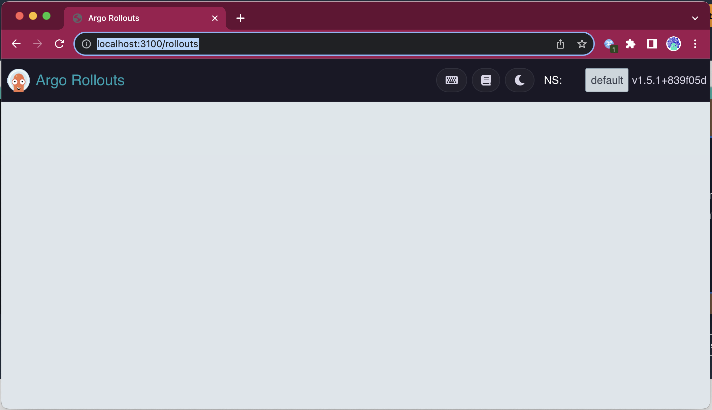
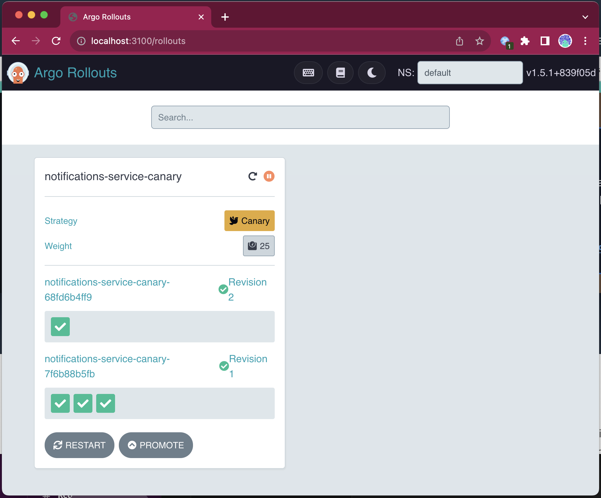
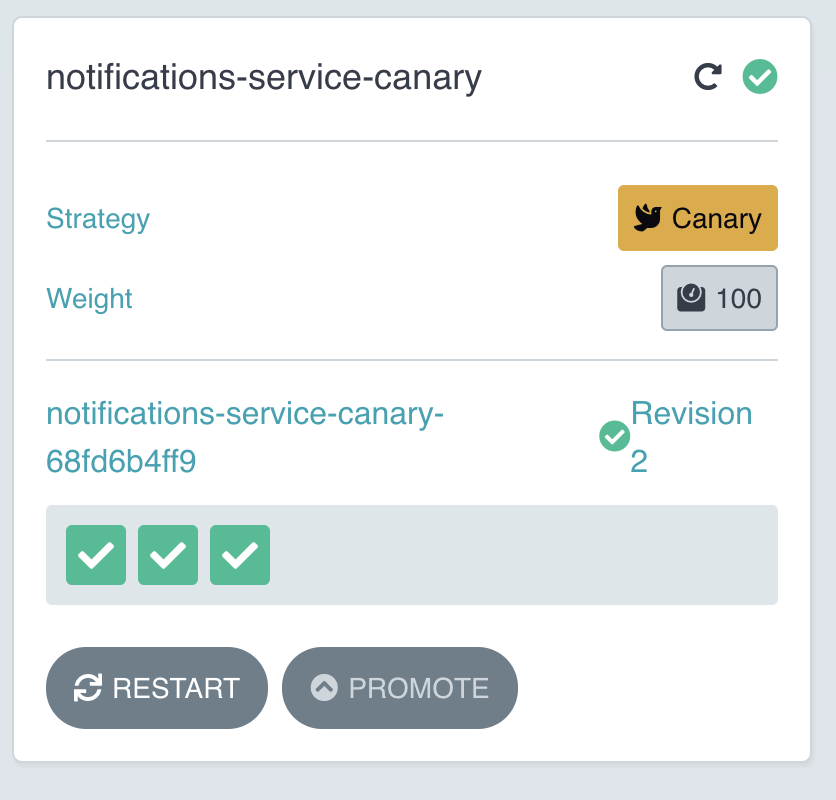
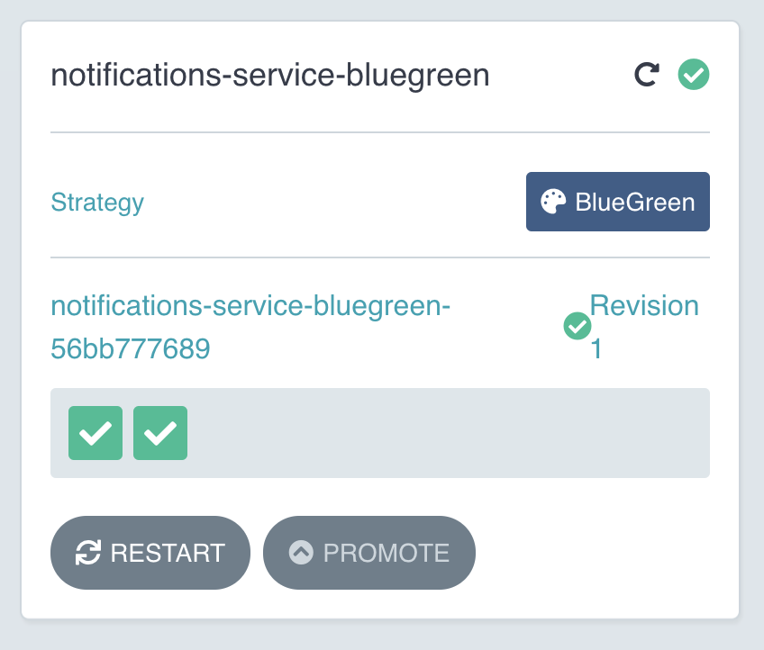
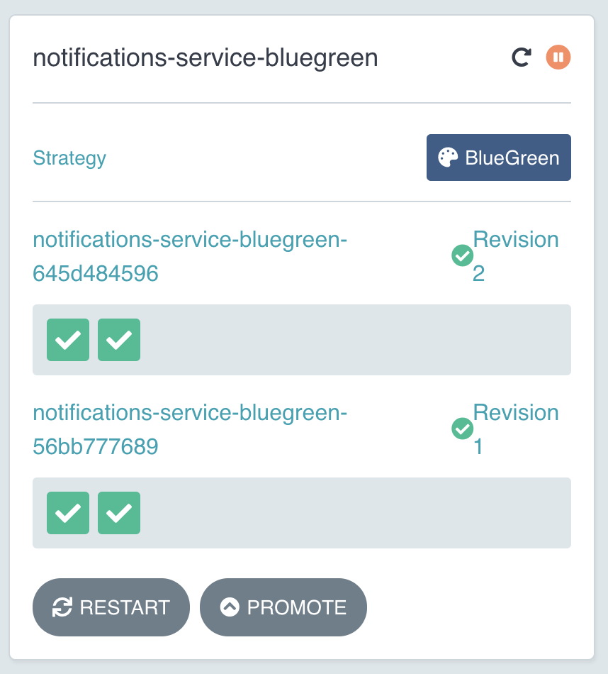

# 使用 Argo Rollouts 实现发布策略

本文中我们尝试一下 Argo Rollout 内置的策略化发布的能力。另外我们还会看看 Argo Rollout 的 Dashboard，有了 Dashboard，团队就可以脱离终端（`kubectl`）进行发布了。

## 安装

首先需要有个 Kubernetes 集群来运行 [Argo Rollouts](https://argoproj.github.io/rollouts/)。可以用[第二章](../../chapter-2/README-zh.md)介绍的方法部署一个 Kind 集群。

有了集群之后，就可以安装 Argo Rollout 了：

```shell
kubectl create namespace argo-rollouts
kubectl apply -n argo-rollouts -f https://github.com/argoproj/argo-rollouts/releases/latest/download/install.yaml

```

或者也可以阅读一下[官方文档](https://argoproj.github.io/argo-rollouts/installation/#controller-installation)

另外还需要安装 [Argo Rollout 的 `kubectl` 插件](https://argoproj.github.io/argo-rollouts/installation/#kubectl-plugin-installation)

插件完成安装之后，在新的终端窗口中运行命令，启动一个本地的 Argo Rollout Dashboard：

```shell
kubectl argo rollouts dashboard
```

这样就可以用浏览器访问 [Dashboar](http://localhost:3100/rollouts) 了。



## 金丝雀发布

创建一个 Argo Rollout 资源，给 Notification 服务实现金丝雀发布能力，[完整声明在此](canary-release/rollout.yaml)。

```yaml
apiVersion: argoproj.io/v1alpha1
kind: Rollout
metadata:
  name: notifications-service-canary
spec:
  replicas: 3
  strategy:
    canary:
      steps:
      - setWeight: 25
      - pause: {}
      - setWeight: 75
      - pause: {duration: 10}
  revisionHistoryLimit: 2
  selector:
    matchLabels:
      app: notifications-service
  template:
    metadata:
      labels:
        app: notifications-service
    spec:
      containers:
      - name: notifications-service
        image: salaboy/notifications-service-0e27884e01429ab7e350cb5dff61b525:v1.0.0
        env: 
          - name: KAFKA_URL
            value: kafka.default.svc.cluster.local
          ... 
        ports:
        - name: http
          containerPort: 8080
          protocol: TCP
        resources:
          limits:
            cpu: "1"
            memory: 256Mi
          requests:
            cpu: "0.1"
            memory: 256Mi

```

`Rollout` 资源替换了 Kubernetes 的 `Deployment` 资源。这意味着我们需要创建一个 Kubernetes Service 和 Ingress 资源来对 Notification 服务的路由。这里我们给 Notification 服务定义了三个副本。

`Rollout` 中定义了两步骤组成的金丝雀发布过程：

```yaml
strategy:
    canary:
      steps:
      - setWeight: 25
      - pause: {}
      - setWeight: 75
      - pause: {duration: 10}
```

首先设置 25% 的流量到新版本，然后暂停（`pause`），等待团队对新版本进行测试，然后我们会手动发出信号，将 75% 流量路由给新版本，经过 10 秒钟暂停之后，100% 流量会被引入新版本。

在提交 `canary-release/` 目录里面的 `Rollout`、`Service` 和 `Ingress` 资源之前，首先我们给 Notification 服务部署一个 Kafka 实例：

```shell
helm install kafka oci://registry-1.docker.io/bitnamicharts/kafka --version 22.1.5 --set "provisioning.topics[0].name=events-topic" --set "provisioning.topics[0].partitions=1" --set "persistence.size=1Gi" 

```

Kafka 成功启动后，我们把 `canary-release/` 目录的所有资源提交给集群：

```shell
kubectl apply -f canary-release/
```

使用 Argo Rollout 插件，你可以在终端查看 `Rollout` 对象：

```shell
kubectl argo rollouts get rollout notifications-service-canary --watch
```

你会看到类似这样的输出：

```shell
Name:            notifications-service-canary
Namespace:       default
Status:          ✔ Healthy
Strategy:        Canary
  Step:          4/4
  SetWeight:     100
  ActualWeight:  100
Images:          salaboy/notifications-service-0e27884e01429ab7e350cb5dff61b525:v1.0.0 (stable)
Replicas:
  Desired:       3
  Current:       3
  Updated:       3
  Ready:         3
  Available:     3

NAME                                                      KIND        STATUS     AGE  INFO
⟳ notifications-service-canary                            Rollout     ✔ Healthy  80s  
└──# revision:1                                                                       
   └──⧉ notifications-service-canary-7f6b88b5fb           ReplicaSet  ✔ Healthy  80s  stable
      ├──□ notifications-service-canary-7f6b88b5fb-d86s2  Pod         ✔ Running  80s  ready:1/1
      ├──□ notifications-service-canary-7f6b88b5fb-dss5c  Pod         ✔ Running  80s  ready:1/1
      └──□ notifications-service-canary-7f6b88b5fb-tw8fj  Pod         ✔ Running  80s  ready:1/1
```

如你所见，我们创建 `Rollout` 对象之后，产生了三个副本，全部流量都路由到初始的 `revision:1`，服务状态为 `Healthy`。

用下面的命令，把 Notification 服务版本更新到 `v1.1.0`：

```shell
kubectl argo rollouts set image notifications-service-canary \
  notifications-service=salaboy/notifications-service-0e27884e01429ab7e350cb5dff61b525:v1.1.0
```

现在会看到 `revision:2` 出现了：

```shell
Name:            notifications-service-canary
Namespace:       default
Status:          ॥ Paused
Message:         CanaryPauseStep
Strategy:        Canary
  Step:          1/4
  SetWeight:     25
  ActualWeight:  25
Images:          salaboy/notifications-service-0e27884e01429ab7e350cb5dff61b525:v1.0.0 (stable)
                 salaboy/notifications-service-0e27884e01429ab7e350cb5dff61b525:v1.1.0 (canary)
Replicas:
  Desired:       3
  Current:       4
  Updated:       1
  Ready:         4
  Available:     4

NAME                                                      KIND        STATUS     AGE    INFO
⟳ notifications-service-canary                            Rollout     ॥ Paused   4m29s  
├──# revision:2                                                                         
│  └──⧉ notifications-service-canary-68fd6b4ff9           ReplicaSet  ✔ Healthy  14s    canary
│     └──□ notifications-service-canary-68fd6b4ff9-jrjxh  Pod         ✔ Running  14s    ready:1/1
└──# revision:1                                                                         
   └──⧉ notifications-service-canary-7f6b88b5fb           ReplicaSet  ✔ Healthy  4m29s  stable
      ├──□ notifications-service-canary-7f6b88b5fb-d86s2  Pod         ✔ Running  4m29s  ready:1/1
      ├──□ notifications-service-canary-7f6b88b5fb-dss5c  Pod         ✔ Running  4m29s  ready:1/1
      └──□ notifications-service-canary-7f6b88b5fb-tw8fj  Pod         ✔ Running  4m29s  ready:1/1
```

现在 `Rollout` 停在了第一步，只有 25% 的流量被路由到了 `revision:2`，状态被设置为 `Pause`。

浏览 `service/info`，看看是哪个版本在响应你的请求：

```shell
curl localhost/service/info
```

`v1.1.0` 大约会处理 1/4 的请求：

```shell
> curl localhost/service/info | jq

{
    "name":"NOTIFICATIONS",
    "version":"1.0.0",
    "source":"https://github.com/salaboy/platforms-on-k8s/tree/main/conference-application/notifications-service",
    "podName":"notifications-service-canary-7f6b88b5fb-tw8fj",
    "podNamespace":"default",
    "podNodeName":"dev-worker2",
    "podIp":"10.244.3.3",
    "podServiceAccount":"default"
}

> curl localhost/service/info | jq

{
    "name":"NOTIFICATIONS",
    "version":"1.0.0",
    "source":"https://github.com/salaboy/platforms-on-k8s/tree/main/conference-application/notifications-service",
    "podName":"notifications-service-canary-7f6b88b5fb-tw8fj",
    "podNamespace":"default",
    "podNodeName":"dev-worker2",
    "podIp":"10.244.3.3",
    "podServiceAccount":"default"
}

> curl localhost/service/info | jq

{
    "name":"NOTIFICATIONS-IMPROVED",
    "version":"1.1.0",
    "source":"https://github.com/salaboy/platforms-on-k8s/tree/v1.1.0/conference-application/notifications-service",
    "podName":"notifications-service-canary-68fd6b4ff9-jrjxh",
    "podNamespace":"default",
    "podNodeName":"dev-worker",
    "podIp":"10.244.2.4",
    "podServiceAccount":"default"
}

> curl localhost/service/info | jq

{
    "name":"NOTIFICATIONS",
    "version":"1.0.0",
    "source":"https://github.com/salaboy/platforms-on-k8s/tree/main/conference-application/notifications-service",
    "podName":"notifications-service-canary-7f6b88b5fb-tw8fj",
    "podNamespace":"default",
    "podNodeName":"dev-worker2",
    "podIp":"10.244.3.3",
    "podServiceAccount":"default"
}

```

检查一下 Argo Rollout Dashboard，就会看到金丝雀发布过程：



可以用 `promote` 命令，或者 Dashboard 上的 `Promote` 按钮来推动金丝雀过程，命令大致如下：

```shell
kubectl argo rollouts promote notifications-service-canary
```

这会把金丝雀进程推进一步，75% 的流量进入新版本，10 秒钟之后，100% 流量都会进入新版本。在终端中查看是这样的：

```shell
Name:            notifications-service-canary
Namespace:       default
Status:          ✔ Healthy
Strategy:        Canary
  Step:          4/4
  SetWeight:     100
  ActualWeight:  100
Images:          salaboy/notifications-service-0e27884e01429ab7e350cb5dff61b525:v1.1.0 (stable)
Replicas:
  Desired:       3
  Current:       3
  Updated:       3
  Ready:         3
  Available:     3

NAME                                                      KIND        STATUS        AGE  INFO
⟳ notifications-service-canary                            Rollout     ✔ Healthy     16m  
├──# revision:2                                                                          
│  └──⧉ notifications-service-canary-68fd6b4ff9           ReplicaSet  ✔ Healthy     11m  stable
│     ├──□ notifications-service-canary-68fd6b4ff9-jrjxh  Pod         ✔ Running     11m  ready:1/1
│     ├──□ notifications-service-canary-68fd6b4ff9-q4zgj  Pod         ✔ Running     51s  ready:1/1
│     └──□ notifications-service-canary-68fd6b4ff9-fctjv  Pod         ✔ Running     46s  ready:1/1
└──# revision:1                                                                          
   └──⧉ notifications-service-canary-7f6b88b5fb           ReplicaSet  • ScaledDown  16m  

```

而在 Dashboard：



现在所有流量都由 `v1.1.0` 响应：

```shell

> curl localhost/service/info

{
    "name":"NOTIFICATIONS-IMPROVED",
    "version":"1.1.0",
    "source":"https://github.com/salaboy/platforms-on-k8s/tree/v1.1.0/conference-application/notifications-service",
    "podName":"notifications-service-canary-68fd6b4ff9-jrjxh",
    "podNamespace":"default",
    "podNodeName":"dev-worker",
    "podIp":"10.244.2.4",
    "podServiceAccount":"default"
}

> curl localhost/service/info

{
    "name":"NOTIFICATIONS-IMPROVED",
    "version":"1.1.0",
    "source":"https://github.com/salaboy/platforms-on-k8s/tree/v1.1.0/conference-application/notifications-service",
    "podName":"notifications-service-canary-68fd6b4ff9-jrjxh",
    "podNamespace":"default",
    "podNodeName":"dev-worker",
    "podIp":"10.244.2.4",
    "podServiceAccount":"default"
}

> curl localhost/service/info

{
    "name":"NOTIFICATIONS-IMPROVED",
    "version":"1.1.0",
    "source":"https://github.com/salaboy/platforms-on-k8s/tree/v1.1.0/conference-application/notifications-service",
    "podName":"notifications-service-canary-68fd6b4ff9-jrjxh",
    "podNamespace":"default",
    "podNodeName":"dev-worker",
    "podIp":"10.244.2.4",
    "podServiceAccount":"default"
}

```

在开始蓝绿部署之前，我们先删除金丝雀 `Rollout`：

```shell
kubectl delete -f canary-release/
```

## 蓝绿部署

蓝绿部署指的是同时运行一个服务的两个版本，所有用户都会访问蓝（活动）版本，绿（预览）版本则专供内部团队访问，便于对新功能进行测试。

Argo Rollouts 内置了蓝绿策略：

```yaml
apiVersion: argoproj.io/v1alpha1
kind: Rollout
metadata:
  name: notifications-service-bluegreen
spec:
  replicas: 2
  revisionHistoryLimit: 2
  selector:
    matchLabels:
      app: notifications-service
  template:
    metadata:
      labels:
        app: notifications-service
    spec:
      containers:
      - name: notifications-service
        image: salaboy/notifications-service-0e27884e01429ab7e350cb5dff61b525:v1.0.0
        env: 
          - name: KAFKA_URL
            value: kafka.default.svc.cluster.local
          ..
  strategy:
    blueGreen: 
      activeService: notifications-service-blue
      previewService: notifications-service-green
      autoPromotionEnabled: false
```

这次我们还是选用 Notification 服务测试蓝绿机制。首先为 Notification 服务定义一个蓝绿部署。这个蓝绿部署会指向两个服务：`notifications-service-blue` 以及 `notifications-service-green`。注意这里的 `autoPromotionEnabled` 开关被设置为 `false`，防止新版本就绪之后直接升级。

检查一下，前面步骤部署的 Kafka 是否正常运行，然后提交 `blue-green/` 目录里的所有内容：

```shell
kubectl apply -f blue-green/
```

这操作的结果是创建一个 `Rollout` 资源，两个 Kubernetes Service 以及两个 Ingress 资源，一套是蓝服务，从 `/` 获得流量，另一套是绿服务，从 `/preview` 获得流量。

运行下面的命令，查询 `Rollout` 状态：

```shell
kubectl argo rollouts get rollout notifications-service-bluegreen --watch
```

你会看到这样的内容：

```
Name:            notifications-service-bluegreen
Namespace:       default
Status:          ✔ Healthy
Strategy:        BlueGreen
Images:          salaboy/notifications-service-0e27884e01429ab7e350cb5dff61b525:v1.0.0 (stable, active)
Replicas:
  Desired:       2
  Current:       2
  Updated:       2
  Ready:         2
  Available:     2

NAME                                                         KIND        STATUS     AGE    INFO
⟳ notifications-service-bluegreen                            Rollout     ✔ Healthy  3m16s  
└──# revision:1                                                                            
   └──⧉ notifications-service-bluegreen-56bb777689           ReplicaSet  ✔ Healthy  2m56s  stable,active
      ├──□ notifications-service-bluegreen-56bb777689-j5ntk  Pod         ✔ Running  2m56s  ready:1/1
      └──□ notifications-service-bluegreen-56bb777689-qzg9l  Pod         ✔ Running  2m56s  ready:1/1

```

这里看到了 Notification 服务的两个副本都在运行。如果我们用 `curl` 访问 `localhost/service/info`，会看到来自 `v1.0.0` 的信息：

```shell
> curl localhost/service/info | jq

{
    "name":"NOTIFICATIONS",
    "version":"1.0.0",
    "source":"https://github.com/salaboy/platforms-on-k8s/tree/main/conference-application/notifications-service",
    "podName":"notifications-service-canary-7f6b88b5fb-tw8fj",
    "podNamespace":"default",
    "podNodeName":"dev-worker2",
    "podIp":"10.244.3.3",
    "podServiceAccount":"default"
}
```

Argo Rollouts Dashboard 中则会如此展示：



和我们在金丝雀发布过程中做的事情类似，我们可以更新 `Rollout` 配置，这里我们设置下 `v1.1.0` 的镜像：

```shell
kubectl argo rollouts set image notifications-service-bluegreen \
  notifications-service=salaboy/notifications-service-0e27884e01429ab7e350cb5dff61b525:v1.1.0
```

这下在终端中你能看到，两个版本的 Notification 服务正在同时运行：

```shell
Name:            notifications-service-bluegreen
Namespace:       default
Status:          ॥ Paused
Message:         BlueGreenPause
Strategy:        BlueGreen
Images:          salaboy/notifications-service-0e27884e01429ab7e350cb5dff61b525:v1.0.0 (stable, active)
                 salaboy/notifications-service-0e27884e01429ab7e350cb5dff61b525:v1.1.0 (preview)
Replicas:
  Desired:       2
  Current:       4
  Updated:       2
  Ready:         2
  Available:     2

NAME                                                         KIND        STATUS     AGE    INFO
⟳ notifications-service-bluegreen                            Rollout     ॥ Paused   8m54s  
├──# revision:2                                                                            
│  └──⧉ notifications-service-bluegreen-645d484596           ReplicaSet  ✔ Healthy  16s    preview
│     ├──□ notifications-service-bluegreen-645d484596-ffhsm  Pod         ✔ Running  16s    ready:1/1
│     └──□ notifications-service-bluegreen-645d484596-g2zr4  Pod         ✔ Running  16s    ready:1/1
└──# revision:1                                                                            
   └──⧉ notifications-service-bluegreen-56bb777689           ReplicaSet  ✔ Healthy  8m34s  stable,active
      ├──□ notifications-service-bluegreen-56bb777689-j5ntk  Pod         ✔ Running  8m34s  ready:1/1
      └──□ notifications-service-bluegreen-56bb777689-qzg9l  Pod         ✔ Running  8m34s  ready:1/1
```

`v1.0.0` 和 `v1.1.0` 都在运行，健康情况良好。但是蓝绿 Rollout 的状态是暂停的。两个版本会同时运行，一直到负责验证的团队确认 `preview` 版本就绪为止。

检查一下 Dashboard，也会看到两个版本同时运行：



这时你可以根据 Ingress 定义发送请求到两个版本。`localhost/service/info` 指向蓝版本而 `localhost/preview/service/` 指向用于预览的绿版本。

```shell
> curl localhost/service/info

{
    "name":"NOTIFICATIONS",
    "version":"1.0.0",
    "source":"https://github.com/salaboy/platforms-on-k8s/tree/main/conference-application/notifications-service",
    "podName":"notifications-service-canary-7f6b88b5fb-tw8fj",
    "podNamespace":"default",
    "podNodeName":"dev-worker2",
    "podIp":"10.244.3.3",
    "podServiceAccount":"default"
}
```

现在看看绿服务：

```shell
> curl localhost/green/service/info

{
    "name":"NOTIFICATIONS-IMPROVED",
    "version":"1.1.0",
    "source":"https://github.com/salaboy/platforms-on-k8s/tree/v1.1.0/conference-application/notifications-service",
    "podName":"notifications-service-canary-68fd6b4ff9-jrjxh",
    "podNamespace":"default",
    "podNodeName":"dev-worker",
    "podIp":"10.244.2.4",
    "podServiceAccount":"default"
}
```

如果我们对结果满意，就可以把旅服务升级为新的稳定版本，同样地，我们可以用命令行或者 Dashboard 完成这个操作：

```shell
kubectl argo rollouts promote notifications-service-bluegreen
```

终端可以看到：

```shell
Name:            notifications-service-bluegreen
Namespace:       default
Status:          ✔ Healthy
Strategy:        BlueGreen
Images:          salaboy/notifications-service-0e27884e01429ab7e350cb5dff61b525:v1.0.0
                 salaboy/notifications-service-0e27884e01429ab7e350cb5dff61b525:v1.1.0 (stable, active)
Replicas:
  Desired:       2
  Current:       4
  Updated:       2
  Ready:         2
  Available:     2

NAME                                                         KIND        STATUS     AGE    INFO
⟳ notifications-service-bluegreen                            Rollout     ✔ Healthy  2m44s  
├──# revision:2                                                                            
│  └──⧉ notifications-service-bluegreen-645d484596           ReplicaSet  ✔ Healthy  2m27s  stable,active
│     ├──□ notifications-service-bluegreen-645d484596-fnbg7  Pod         ✔ Running  2m27s  ready:1/1
│     └──□ notifications-service-bluegreen-645d484596-ntcbf  Pod         ✔ Running  2m27s  ready:1/1
└──# revision:1                                                                            
   └──⧉ notifications-service-bluegreen-56bb777689           ReplicaSet  ✔ Healthy  2m44s  delay:9s
      ├──□ notifications-service-bluegreen-56bb777689-k6qxk  Pod         ✔ Running  2m44s  ready:1/1
      └──□ notifications-service-bluegreen-56bb777689-vzsw7  Pod         ✔ Running  2m44s  ready:1/1
```

现在的稳定版本是 `revision:2`。你会看到 `revision:1` 还会继续存活一段时间——这是为了给我们时间进行回滚。几秒钟之后，老版本开始缩容。

检查 Dashboard 看看我们的 `Rollout` 也是 `revision:2`：


走到这里，我们借助 Argo Rollouts 完整的实现了金丝雀和蓝绿部署。

## 清理

可以用如下命令删除 Kind 集群：

```shell
kind delete clusters dev
```
