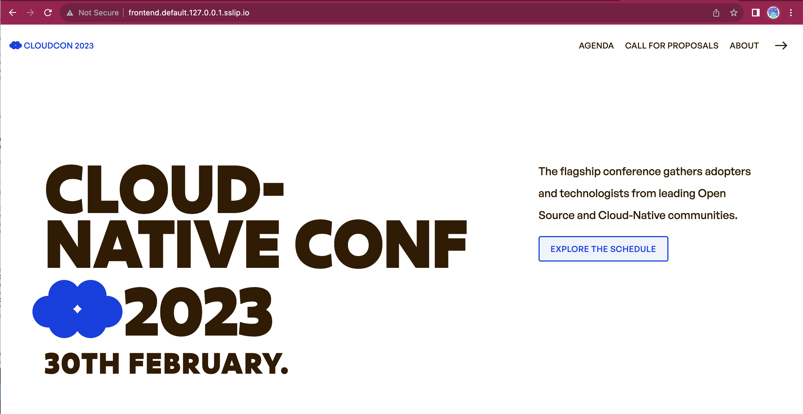
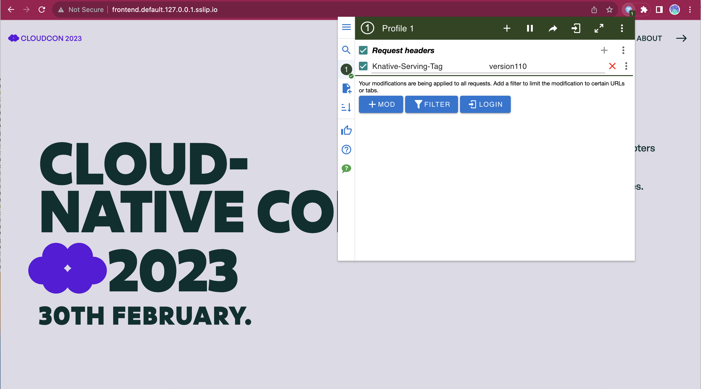

# 使用 Knative Serving 实现发布策略

在本教程中，我们会在 Kubernetes 集群中安装 Knative Serving，我们将使用 Knative Serving 基于百分比的流量分割以及基于标签和 Header 的路由能力，实现不同的发布策略。

## 创建集群并部署 Knative

要提供一个 Kubernetes 集群来安装 [Knative Serving](https://knative.dev)，但是这次的集群和第二章不同，我们会用如下命令来构建集群：

```shell
cat <<EOF | kind create cluster --name dev --config=-
kind: Cluster
apiVersion: kind.x-k8s.io/v1alpha4
nodes:
- role: control-plane
  extraPortMappings:
  - containerPort: 31080 # expose port 31380 of the node to port 80 on the host, later to be use by kourier or contour ingress
    listenAddress: 127.0.0.1
    hostPort: 80
EOF
```

这个场景中无需 Ingress 控制器，Knative Serving 需要更高级的网络栈来启用流量路由和分割的能力。我们会安装 [Kourier](https://github.com/knative-extensions/net-kourier) 来达成目标，你也可以使用更完整的 [Istio](https://istio.io/) 之类的服务网格产品。

有了集群之后，就开始安装 [Knative Serving](https://knative.dev/docs/install/yaml-install/serving/install-serving-with-yaml/)，可以跟随官方文档进行操作，也可以拷贝下面的命令，已经针对本案例对命令中的版本进行了测试。

安装 Knative Serving 的 CRD：

```shell
kubectl apply -f https://github.com/knative/serving/releases/download/knative-v1.10.2/serving-crds.yaml

```

安装 Knative Serving 控制面：

```shell
kubectl apply -f https://github.com/knative/serving/releases/download/knative-v1.10.2/serving-core.yaml

```

安装一个兼容的 Knative Serving 网络栈，前面说过，可以选择简单的 Kourier 或者完整的 Istio。我们在这里选择 Kourier，以便节省集群资源：

```shell
kubectl apply -f https://github.com/knative/net-kourier/releases/download/knative-v1.10.0/kourier.yaml

```

设置 Kourier 为 Knative Serving 的网络栈：

```shell
kubectl patch configmap/config-network \
  --namespace knative-serving \
  --type merge \
  --patch '{"data":{"ingress-class":"kourier.ingress.networking.knative.dev"}}'
```

最后配置集群的 DNS 解析，让 DNS 能够给出外部可访问的 URL：

```shell
kubectl apply -f https://github.com/knative/serving/releases/download/knative-v1.10.2/serving-default-domain.yaml

```

### 针对在 Kind 集群上运行的 Knative

要让 Knative 的 DNS 能够在 Kind 集群上生效，你要对后面的 ConfigMap 打个补丁：

```shell
kubectl patch configmap -n knative-serving config-domain -p "{\"data\": {\"127.0.0.1.sslip.io\": \"\"}}"
```

如果安装了 `kourier` 网络层，接下来就创建一个 Ingress：

```shell
cat <<EOF | kubectl apply -f -
apiVersion: v1
kind: Service
metadata:
  name: kourier-ingress
  namespace: kourier-system
  labels:
    networking.knative.dev/ingress-provider: kourier
spec:
  type: NodePort
  selector:
    app: 3scale-kourier-gateway
  ports:
    - name: http2
      nodePort: 31080
      port: 80
      targetPort: 8080
EOF
```

下一步就是运行后续内容所需的例子，启用 `tag-header-based-routing` 并使用 [Kubernetes Downward API](https://knative.dev/docs/serving/configuration/feature-flags/#kubernetes-downward-api) 来获取集群里 Pod 的信息。可以通过对 [Configmap 的补丁]((https://knative.dev/docs/serving/configuration/feature-flags/#feature-and-extension-flags))来调整 Knative Serving 的行为：

```shell
kubectl patch cm config-features -n knative-serving -p '{"data":{"tag-header-based-routing":"Enabled", "kubernetes.podspec-fieldref": "Enabled"}}'
```

配置完成后，就可以开始使用 Knative 来继续我们的尝试，但是在开始实现不同的发布策略之前，我们首先要了解一下 Knative Serving 的基础内容。我们会给 Notification 定义一个 Knative Service，以此作为了解 Knative Serving 的窗口。

## Knative Service 快速入门

Knative Serving 通过使用 `Knative Service` 的概念简化和扩展了 Kubernetes 提供的功能。无需定义复杂的 Kubernetes 资源，`Knative Service` 使用 Knative 网络层将流量路由到我们的工作负载。Knative Serving 是知道到流量如何进入服务的，因此它可以了解我们的服务当前的负载情况，能够按需构建自动调节器来对服务实例进行扩缩容。对于希望实现 FaaS 能力的平台团队来说， Knative Serving 的自动扩缩容、甚至缩容到 0 的能力非常有用。

Knative Service 还开放了一个简单的配置，提供一个容器即服务的功能，类似简化的 Google Cloud Run、Azure Container Apps 以及 AWS App Runner。只要定义了要运行的容器，平台就会完成剩余的工作（无需进行复杂的网络、路由、流量等设置）。

Notification 要使用 Kafka 进行事件操作，所以我们先用 Helm 安装一下 Kafka：

```shell
helm install kafka oci://registry-1.docker.io/bitnamicharts/kafka --version 22.1.5 --set "provisioning.topics[0].name=events-topic" --set "provisioning.topics[0].partitions=1" --set "persistence.size=1Gi" 
```

Kafka 需要时间来拉取镜像和启动，所以在继续其他步骤之前，首先确保 Kafka 正常运行。

运行有 Knative Serving 的 Kubernetes 集群，可以用下面的资源来运行我们的 Notification 服务：

```yaml
apiVersion: serving.knative.dev/v1
kind: Service
metadata:
  name: notifications-service 
spec:
  template:
    spec:
      containers:
        - image: salaboy/notifications-service-0e27884e01429ab7e350cb5dff61b525:v1.0.0
          env:
          - name: KAFKA_URL
            value: kafka.default.svc.cluster.local
          ...<MORE ENVIRONMENT VARIABLES HERE>...  
```

把资源提交到集群：

```shell
kubectl apply -f knative/notifications-service.yaml
```

Knative Serving 会为我们的容器创建一个实例，并设置所需的网络配置，提供一个可以访问该服务的 URL。

列出所有的 Knative Serving 服务：

```shell
> kubectl get ksvc 
NAME                    URL                                                       LATESTCREATED                 LATESTREADY                   READY   REASON
notifications-service   http://notifications-service.default.127.0.0.1.sslip.io   notifications-service-00001   notifications-service-00001   True    

```

`curl` 访问一下 `service/info`，看看服务是否正常，可以使用 [`jq`](https://jqlang.github.io/jq/download/) 来美化一下输出内容：

```shell
curl http://notifications-service.default.127.0.0.1.sslip.io/service/info | jq 
```

输出内容如下：

```json
{
    "name": "NOTIFICATIONS",
    "podIp": "10.244.0.16",
    "podName": "notifications-service-00001-deployment-7ff76b4c77-qkk69",
    "podNamespace": "default",
    "podNodeName": "dev-control-plane",
    "podServiceAccount": "default",
    "source": "https://github.com/salaboy/platforms-on-k8s/tree/main/conference-application/notifications-service",
    "version": "1.0.0"
}

```

检查一下运行中的容器：

```shell
> kubectl get pods
NAME                                                      READY   STATUS    RESTARTS   AGE
kafka-0                                                   1/1     Running   0          7m54s
notifications-service-00001-deployment-798f8f79f5-jrbr8   2/2     Running   0          4s
```

这里有 Notification Pod 里面有两个正在运行的容器，一个是 Notificaiton 服务，另一个是 Knative Serving 的代理，用于代理进入的流量并产生流量指标。

90 秒（默认）之后，如果没有给 Notification 服务发送请求，这个请求会被自动缩容。如果有新的请求进入，Knative Serving 会自动扩容服务，在新实例完成启动之前，请求在队列中缓存等待。

Knative Serving 中提供了两个开箱即用的能力：

- 一种简单的无需创建多个 Kubernetes 资源就能运行工作负载的方法。这种方法类似于一种容器即服务的能力，作为平台团队，很可能希望为研发团队提供这样的能力。

- 借助 Knative Autoscaler 进行动态自动伸缩的能力。在服务没有被使用的时候，应用会被缩容到 0。这种类似于 FaaS 的方式，也可能是研发团队需要平台团队提供的东西。

## 使用 Knative Service 运行会议应用

在本节中，我们会使用 Knative 为我们的会议应用实现不同的策略，让所有服务都用上 Knative Service。

前面已经装好了 Kafka，所以在安装其他服务之前，我们还要把 PostgreSQL 和 Redis 也准备就绪。在部署 PostgreSQL 之前，我们需要创建一个 Configmap，其中包含的 SQL 语句能创建 `Proposals` 数据表，Helm Chart 能够引用这个 ConfigMap，在数据库实例启动之后，执行 Configmap 中的 SQL 语句。

```shell
$ kubectl apply -f knative/c4p-sql-init.yaml
...

$ helm install postgresql oci://registry-1.docker.io/bitnamicharts/postgresql --version 12.5.7 --set "image.debug=true" --set "primary.initdb.user=postgres" --set "primary.initdb.password=postgres" --set "primary.initdb.scriptsConfigMap=c4p-init-sql" --set "global.postgresql.auth.postgresPassword=postgres" --set "primary.persistence.size=1Gi"

```

然后是 Redis：

```shell
helm install redis oci://registry-1.docker.io/bitnamicharts/redis --version 17.11.3 --set "architecture=standalone" --set "master.persistence.size=1Gi"
```

这样我们就可以安装其他服务了（Frontend、C4P Service 以及 Agenda）：

```shell
kubectl apply -f knative/
```

检查一下，所有的 Knative Service 对象都已经就绪：

```shell
> kubectl get ksvc
NAME                    URL                                                       LATESTCREATED                 LATESTREADY                   READY   REASON
agenda-service          http://agenda-service.default.127.0.0.1.sslip.io          agenda-service-00001          agenda-service-00001          True    
c4p-service             http://c4p-service.default.127.0.0.1.sslip.io             c4p-service-00001             c4p-service-00001             True    
frontend                http://frontend.default.127.0.0.1.sslip.io                frontend-00001                frontend-00001                True    
notifications-service   http://notifications-service.default.127.0.0.1.sslip.io   notifications-service-00001   notifications-service-00001   True    

```

用浏览器打开 [http://frontend.default.127.0.0.1.sslip.io](http://frontend.default.127.0.0.1.sslip.io)，来访问会议应用的 Frontend 服务。

应用应该能够正常服务，区别在于，Agentda 和 C4P 因为无人使用，所以都会缩容。空置 90 秒之后列表显示 Pod，会看到如下情况：

```shell
> kubectl get pods 
NAME                                                     READY   STATUS    RESTARTS   AGE
frontend-00002-deployment-7fdfb7b8c5-cw67t               2/2     Running   0          60s
kafka-0                                                  1/1     Running   0          20m
notifications-service-00002-deployment-c5787bc49-flcc9   2/2     Running   0          60s
postgresql-0                                             1/1     Running   0          9m23s
redis-master-0                                           1/1     Running   0          8m50s
```

因为 Agenda 和 C4P 服务都在持久存储（Redis 和 PostgreSQL）中保存了数据，所以他们被缩容到 0 也不会丢失数据。但是 Notification 和 Frontend 都在内存里保存了数据，所以我们要求 Knative 至少保存他们的一个实例。内存中保存数据的示例都会被缩容场景影响，所以在真正的应用中应该避免这种情况。

现在我们的应用已经启动，接下来看看部署策略如何实现。

## 金丝雀发布

本节中，我们会运行一个简单的例子，展示用 Knative Service 实现金丝雀的方法。我们会使用百分比的方式实现流量切分。

Knative Serving 内置了百分比方式的流量分配能力。我们会升级 之前部署的 Notification 服务，而不是 Frontend，这是因为 CSS 以及 Javascript 的获取都是由多个请求处理的，在按百分比分流的场景下，面向浏览器的前端应用的升级会更加复杂。

为了确保服务正常运行，可以运行如下命令：

```shell
curl http://notifications-service.default.127.0.0.1.sslip.io/service/info | jq
```

你应该能看到如下结果：

```json
{
    "name": "NOTIFICATIONS",
    "podIp": "10.244.0.16",
    "podName": "notifications-service-00001-deployment-7ff76b4c77-qkk69",
    "podNamespace": "default",
    "podNodeName": "dev-control-plane",
    "podServiceAccount": "default",
    "source": "https://github.com/salaboy/platforms-on-k8s/tree/main/conference-application/notifications-service",
    "version": "1.0.0"
}

```

可以编辑一下 Notification 服务的 Knative Service 对象（`ksvc`），并用更换镜像或者其它配置参数（例如环境变量）的方式创建一个新的版本：

```shell
kubectl edit ksvc notifications-service
```

修改 YAML，从：

```yaml
apiVersion: serving.knative.dev/v1
kind: Service
metadata:
  name: notifications-service 
spec:
  template:
    metadata:
      annotations:
        autoscaling.knative.dev/min-scale: "1"
    spec:
      containers:
        - image: salaboy/notifications-service-0e27884e01429ab7e350cb5dff61b525:v1.0.0  
      ...
```

替换为 `v1.1.0`：

```yaml
apiVersion: serving.knative.dev/v1
kind: Service
metadata:
  name: notifications-service 
spec:
  template:
    metadata:
      annotations:
        autoscaling.knative.dev/min-scale: "1"
    spec:
      containers:
        - image: salaboy/notifications-service-0e27884e01429ab7e350cb5dff61b525:v1.1.0  
      ...
```

保存变更之前，会创建一个新的版本，我们分流到这个新版本，我们需要在 `traffice` 一节中加入如下内容：

```yaml
 traffic:
  - latestRevision: false
    percent: 50
    revisionName: notifications-service-00001
  - latestRevision: true
    percent: 50
```

如果开始访问 `service/info`，就会看到一半的流量被路由到 `v1.0.0`，另一半则访问到了 `v1.1.0`。

```shell
> curl http://notifications-service.default.127.0.0.1.sslip.io/service/info | jq
{
    "name":"NOTIFICATIONS-IMPROVED",
    "version":"1.1.0",
    "source":"https://github.com/salaboy/platforms-on-k8s/tree/v1.1.0/conference-application/notifications-service",
    "podName":"notifications-service-00003-deployment-59fb5bff6c-2gfqt",
    "podNamespace":"default",
    "podNodeName":"dev-control-plane",
    "podIp":"10.244.0.34",
    "podServiceAccount":"default"
}

> curl http://notifications-service.default.127.0.0.1.sslip.io/service/info | jq
{
    "name":"NOTIFICATIONS",
    "version":"1.0.0",
    "source":"https://github.com/salaboy/platforms-on-k8s/tree/main/conference-application/notifications-service",
    "podName":"notifications-service-00001-deployment-7ff76b4c77-h6ts4",
    "podNamespace":"default",
    "podNodeName":"dev-control-plane",
    "podIp":"10.244.0.35",
    "podServiceAccount":"default"
}
```

在发布新版本，但是又不想冒险用新版本承载所有流量的情况下，这种做法就非常有用了。

可以修改流量规则来进行不同比例的分配，如果你对新版本的稳定性信心够大，就可以给它分配更多流量：

```yaml
 traffic:
  - latestRevision: false
    percent: 10
    revisionName: notifications-service-00001
  - latestRevision: true
    percent: 90
```

如果某个版本不再有流量进入，那么这个版本的实例就会被缩容。

## A/B 测试和蓝绿升级

A/B 测试过程中，我们希望运行同一应用的两个或者更多的版本，让不同分组的用户能够对变更进行测试，从而确定版本的测试结果。

Knative Serving 条件下，我们有两个选项：基于 Header 和基于 Tag 的路由，这两种方式的实现机制是类似的，我们先来看看这两种机制的用法。

有了这样的路由方法，我们可以使用 HTTP Header 或者特定的 URL 来触发 Knative 的网络能力，让流量被路由到服务的特定版本里。

也就是说，这个例子里，我们能够修改我们应用的 Frontend，这是因为所有流量只要是有特定的 Header 或者 URL，就会被路由到该服务的同一个版本上。

使用浏览器访问 [http://frontend.default.127.0.0.1.sslip.io](http://frontend.default.127.0.0.1.sslip.io)：



接下来修改 Frontend 的 Knative Service 来部署一个包含调试功能的新版本：

```shell
kubectl edit ksvc frontend
```

修改镜像字段为 `v1.1.0`，并加入 `FEATURE_DEBUG_ENABLED` 环境变量（注意这里用的是没有加入 OpenFeature 的版本）。

```yaml
spec:
      containerConcurrency: 0
      containers:
      - env:
        - name: FEATURE_DEBUG_ENABLED
          value: "true"
       ...
        image: salaboy/frontend-go-1739aa83b5e69d4ccb8a5615830ae66c:v1.1.0
```

保存 Knative Service 之前，先修改一下流量规则：

```yaml
traffic:
  - latestRevision: false
    percent: 100
    revisionName: frontend-00001
    tag: current
  - latestRevision: true
    percent: 0
    tag: version110
```

注意只有 URL 中设置 Tag 才会有流量被路由到 `v1.1.0`，用户可以直接使用 URL（[http://version110-frontend.default.127.0.0.1.sslip.io](http://version110-frontend.default.127.0.0.1.sslip.io)）访问 `v1.1.0`：


注意 `v1.1.0` 里有不同的颜色配置，稍加对比就能看出差异。

假设因为某种考虑，你不需要修改服务的 URL，可以使用 HTTP Header 来访问 `v1.1.0`，这里可以使用 [Chrome ModHeader](https://chrome.google.com/webstore/detail/modheader-modify-http-hea/idgpnmonknjnojddfkpgkljpfnnfcklj) 这样的浏览器插件来修改 HTTP 请求中的参数或者 Header。

这里我们设置 `Knative-Serving-Tag` Header 的值为 `version110`，我们在 Frontend 的流量规则中针对这个 Tag 进行了配置。

接下来我们先访问 `v1.1.0` 版本的服务地址 [http://frontend.default.127.0.0.1.sslip.io](http://frontend.default.127.0.0.1.sslip.io)：



基于 Tag 和 Header 的路由允许我们用同样的方式实现蓝绿部署，可以给绿版本分配一个没有分配到流量的 Tag，这样就把绿版本隐藏起来了。

```yaml
traffic:
    - revisionName: <blue-revision-name>
      percent: 100 # 所有流量都会被路由到这个版本
    - revisionName: <gree-revision-name>
      percent: 0 # 这个版本没有流量
      tag: green # 一个具名路由
```

一旦我们准备好切换到 `green` 版本，就可以修改流量策略了：

```yaml
traffic:
    - revisionName: <blue-revision-name>
      percent: 0 
      tag: blue 
    - revisionName: <gree-revision-name>
      percent: 100
      
```

回放一下，使用 Knative 的流量拆分以及基于 Header/Tag 的路由能力，我们实现了金丝雀、A/B 测试以及蓝绿部署功能。[Knative 官网](https://knative.dev)包含了这个项目的更多信息。

## 清理

可以用如下命令删除 Kind 集群：

```shell
kind delete clusters dev
```
