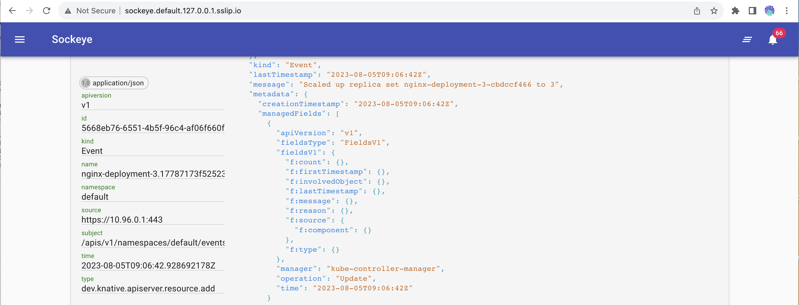
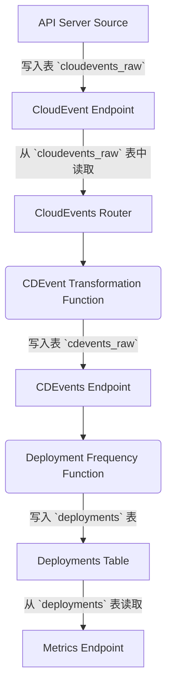

# DORA 指标 + CloudEvents & CDEvents for Kubernetes

本教程安装了一套组件，可以消费多个来源的 [CloudEvents](https://cloudevents.io)，并可以用 Kubernetes 用云无关的方式跟踪 DORA 指标。

本文重点是从不同来源获取数据，然后将这些事件映射到与我们的软件交付实践相关的有意义事件中，最后汇总起来计算 DORA 指标。

整个流程大致如下：

- 不同来源的 [CloudEvents](https://cloudevents.io) 作为数据源。

- 这些 `CloudEvents` 能够被映射和转换为 [CDEvents](https://cdevents.dev)。

- 定义函数来计算 DORA 或者类似的指标。

- 度量指标可用于消费（本例中可以通过 REST 端点进行消费）。

## 部署

我们将使用带有 Knative Serving 的 Kubernetes 集群来运行转换功能。可以用[第八章](../../chapter-8/README-zh.md)的教程来进行部署。

然后，我们将安装 Knative Eventing，我们将使用 Knative Eventing 安装 Kubernetes API Event Source，它可以获取 Kubernetes 内部事件并将其转换为 CloudEvents。

1. 部署 [Knative Eventing](https://knative.dev/docs/install/yaml-install/eventing/install-eventing-with-yaml/)

    ```shell
    kubectl apply -f https://github.com/knative/eventing/releases/download/knative-v1.11.0/eventing-crds.yaml
    kubectl apply -f https://github.com/knative/eventing/releases/download/knative-v1.11.0/eventing-core.yaml
    ```

1. 创建 `dora-cloudevents` namespace: 

    ```shell
    kubectl create ns dora-cloudevents
    ```

1. 安装 PostgreSQL 并建表：

    ```shell
    kubectl apply -f resources/dora-sql-init.yaml
    helm install postgresql oci://registry-1.docker.io/bitnamicharts/postgresql --version 12.5.7 --namespace dora-cloudevents --set "image.debug=true" --set "primary.initdb.user=postgres" --set "primary.initdb.password=postgres" --set "primary.initdb.scriptsConfigMap=dora-init-sql" --set "global.postgresql.auth.postgresPassword=postgres" --set "primary.persistence.size=1Gi"
    ```

1. 部署 Sockeye 来监控 CloudEvents，它对 Knative 有依赖：

    ```shell
    kubectl apply -f https://github.com/n3wscott/sockeye/releases/download/v0.7.0/release.yaml
    ```

1. 安装 [Kubernetes API Server CloudEvent 事件源](https://knative.dev/docs/eventing/sources/apiserversource/getting-started/#create-an-apiserversource-object)：

    ```shell
    kubectl apply -f api-serversource-deployments.yaml
    ```

## 组件

该演示部署了以下组件，用于将 CloudEvents 转换为 CDEvents，然后聚合可用数据。

- **CloudEvents Endpoint**：所有 CloudEvents 会发送给这个端点；这些 CloudEvents 会被存储到 SQL 数据库中的 `cloudevents-raw` 数据表。

- **CloudEvents Router**：负责路由事件，并转成 `CDEvents`。这个机制还可以把同一个事件类型转换成多个 `CDEvents`。该组件从 `cloudevents-raw` 表中读取并处理事件。可以配置一个固定时间段来触发这个组件。

- **CDEvents Transformers**：这些函数从 `CloudEvents Router` 接收事件，并将 CloudEvents 转换为 CDEvents。结果将发送到 `CDEvents Endpoint`。

- **CDEvents Endpoint**：发送 `CDEvents` 的目标，这些事件会被保存在数据库的 `cdevents-raw` 表中。该端点会验证接收到的 CloudEvent 是否为 CD CloudEvent。

- **Metrics Functions**：这些函数负责计算不同的指标，并将其存储到特殊表中，可能每个表都有一个函数。为了计算上述指标，这些函数从 `cdevents-raw` 中读取数据。下面将举例说明如何计算**部署频率**指标。

- **Metrics Endpoint**: 这里按名称查询指标并添加一些过滤器。这是一个可选组件，因为不使用这些端点也能从指标表中创建仪表盘。


## 部署组件并生成数据

首先部署组件和变形函数：

```shell
kubectl apply -f resources/components.yaml
```

打开 [Sockeye](http://sockeye.default.127.0.0.1.sslip.io/) 来监控 CloudEvents。

然后在 `default` 命名空间中创建一个新的 Deployemt 来验证配置是否正常。

```shell
kubectl apply -f test/example-deployment.yaml
```

此时，您应该会在 Sockeye 里看到大量事件：



如果安装了 Deployment Frequency function（转换和计算），就可以查询部署频率的端点并查看指标。请注意，因为 Cron 作业的触发时间，这可能需要几分钟的时间才能看到：

```shell
curl http://dora-frequency-endpoint.dora-cloudevents.127.0.0.1.sslip.io/deploy-frequency/day | jq
```

根据您创建的部署（我创建了两个部署：`nginx-deployment` 和 `nginx-deployment-3`），会看到类似下面的内容：

```json
[
  {
    "DeployName": "nginx-deployment",
    "Deployments": 1,
    "Time": "2023-08-05T00:00:00Z"
  },
  {
    "DeployName": "nginx-deployment-3",
    "Deployments": 1,
    "Time": "2023-08-05T00:00:00Z"
  }
]
```

尝试修改或创建新部署，`default` 名称空间中的所有部署都会被监控。

注意 `dora-cloudevents` 命名空间中的组件。用下面的命令查看一下 Knative Service 的 URL 以及 Pod：

```shell
kubectl get ksvc -n dora-cloudevents
```

检查正在运行的 Pod，因为我们使用的是 Knative Serving，所有不使用的转换功能可能没有运行：

```shell
kubectl get pods -n dora-cloudevents
```

最后，您可以检查所有汇总数据的 CronJob 执行情况：

```shell
kubectl get cronjobs -n dora-cloudevents
```

## 开发

使用 `ko` 部署 `dora-cloudevents` 组件：

```shell
ko apply -f config/
```

> 指标来自：[https://github.com/GoogleCloudPlatform/fourkeys/blob/main/METRICS.md](https://github.com/GoogleCloudPlatform/fourkeys/blob/main/METRICS.md)

## 部署频率


查找新的或更新的部署资源。这是通过使用我们之前配置的 `APIServerSource` 来实现的。

这个流程大致如下：



指标 Bucket：Daily, Weekly, Monthly, Yearly.

这将计算每天的部署次数：

```sql
SELECT
distinct deploy_name AS NAME,
DATE_TRUNC('day', time_created) AS day,
COUNT(distinct deploy_id) AS deployments
FROM
deployments
GROUP BY deploy_name, day;
```

## TODO 和扩展

- 为 `clouddevents_raw` 和 `cdevents_raw` 表添加已处理事件机制。这将避免 `CloudEvents Router` 和 `Metrics Calculation Functions` 重新计算已处理的事件。要做到这一点，可以使用一个表来跟踪上次处理的事件，然后确保 `CloudEvents Router` 和 `Metrics Calculation Functions` 根据新表进行连接。

- 为部署频率指标加入计算桶的查询：在`deployment-frequency-endpoint.go` 中添加计算下列部署频率指标的查询：每周、每月、每年。请参考[博客](https://codefresh.io/learn/software-deployment/dora-metrics-4-key-metrics-for-improving-devops-performance/)中介绍的内容，保证计算的是频率而非数量

- 为常用组件（CloudEvents Endpoint、CDEvents Endpoint、CloudEvents Router）创建 Helm Chart

- 修改 Helm chart 添加[自动建表功能](https://stackoverflow.com/questions/66333474/postgresql-helm-chart-with-initdbscripts)

- 为 **Lead Time for Change** 创建 Function

## 其它数据源和扩展

- [部署 Tekton](https://github.com/cdfoundation/sig-events/tree/main/poc/tekton)
  - Tekton dashboard: `k port-forward svc/tekton-dashboard 9097:9097 -n tekton-pipelines`
  - Cloud Events Controller: `kubectl apply -f https://storage.cloud.google.com/tekton-releases-nightly/cloudevents/latest/release.yaml`
  - ConfigMap: `config-defaults` for <SINK URL>
- https://github.com/GoogleCloudPlatform/fourkeys
- https://cloud.google.com/blog/products/devops-sre/using-the-four-keys-to-measure-your-devops-performance
- Continuously Delivery Events aka [CDEvents](https://cdevents.dev)
- CloudEvents aka [CEs](https://cloudevents.io/)  
- GitHub Source: https://github.com/knative/docs/tree/main/code-samples/eventing/github-source
