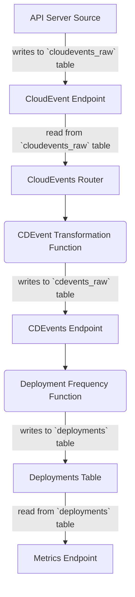

# DORA Metrics + CloudEvents & CDEvents for Kubernetes

This project consumes [CloudEvents](https://cloudevents.io) from multiple sources and allows you to track the DORA metrics, using  a Kubernetes-native architecture (cloud-agnostic).
The main goal of this project is to demonstrate a transformation flow where:
- The inputs are [CloudEvents](https://cloudevents.io)
- These CloudEvents can be mapped and transformed to [CDEvents](https://cdevents.dev) for further processing
- Aggregation functions can be defined to calculate DORA (or other) metrics
- Metrics can be exposed for consumption (in this example via REST endpoints)


## Installation

We will be using a Kubernetes Cluster with Knative Serving for running our transformation functions. You can follow the instructions from [Chapter 8 to create a KinD cluster with Knative Serving installed in it](). 

Then we will install Knative Eventing, this is optional, as we will use Knative Eventing to install the Kubernetes API Event Source, which takes internal Kubernetes Events and transform them in CloudEvents.


1. Install [Knative Eventing](https://knative.dev/docs/install/yaml-install/eventing/install-eventing-with-yaml/)
```
kubectl apply -f https://github.com/knative/eventing/releases/download/knative-v1.11.0/eventing-crds.yaml
kubectl apply -f https://github.com/knative/eventing/releases/download/knative-v1.11.0/eventing-core.yaml
```

1. Create your "dora-cloudevents" namespace: 
```
kubectl create ns dora-cloudevents
```

1. Install PostgreSQL and Create Tables
```
kubectl apply -f resources/dora-sql-init.yaml
helm install postgresql oci://registry-1.docker.io/bitnamicharts/postgresql --version 12.5.7 --set "image.debug=true" --set "primary.initdb.user=postgres" --set "primary.initdb.password=postgres" --set "primary.initdb.scriptsConfigMap=c4p-init-sql" --set "global.postgresql.auth.postgresPassword=postgres" --set "primary.persistence.size=1Gi"
```


1. Install Sockeye: 

```
kubectl apply -f https://github.com/n3wscott/sockeye/releases/download/v0.7.0/release.yaml
```

1. Install the [Kubernetes API Server CloudEvent Event Source](https://knative.dev/docs/eventing/sources/apiserversource/getting-started/#create-an-apiserversource-object): 
```
kubectl apply -f api-serversource-deployments.yaml
```


## Components

- **CloudEvents Endpoint**: Endpoint to send all CloudEvents to; these CloudEvents will be stored in the SQL database to the `cloudevents-raw` table. 

- **CloudEvents Router**: Router, with a routing table, which routes events to be transformed to `CDEvents`. This mechanism allows the same event type to be transformed into multiple `CDEvents`, if needed. This component reads from the `cloudevents-raw` table and processes events. This component is triggered via configurable fixed period of time. 

- **CDEvents Transformers**: These functions receive events from the `CloudEvents Router`  and transforms the CloudEvents to CDEvents. The result is sent to the `CDEvents Endpoint`. 


- **CDEvents Endpoint**: Endpoint to send `CDEvents`, these CloudEvents will be stored in the SQL database to the `cdevents-raw` table, as they do not need any transformation. This endpoint validates that the CloudEvent received is a CD CloudEvent. 

- **Metrics Functions**: These functions are in charge of calculating different metrics and storing them into special tables, probably one per table. To calculate said metrics, these functions read from `cdevents-raw`. An example on how to calculate the **Deployment Frequency** metric is explained below. 

- **Metrics Endpoint**: Endpoint that allows you to query the metrics by name and add some filters. This is an optional component, as you can build a dashboard from the metrics tables without using these endpoints.


## 


## Development 

Deploy the `dora-cloudevents` components using `ko` for development:

```
ko apply -f config/
```


Create a new Deployment in the `default` namespace to test that your configuration is working.

```
kubectl apply -f ../test/example-deployment.yaml
```

If the Deployment Frequency functions (transformation and calculation) are installed you should be able to query the deployment frequency endpoint and see the metric: 

```
curl http://fourkeys-frequency-endpoint.four-keys.127.0.0.1.sslip.io/deploy-frequency/day
```
And see something like this: 

```
[{"DeployName":"nginx-deployment-3","Deployments":1,"Time":"2022-11-28T00:00:00Z"}]
```

Try modifying the deployment or creating new ones.


# Metrics

From [https://github.com/GoogleCloudPlatform/fourkeys/blob/main/METRICS.md](https://github.com/GoogleCloudPlatform/fourkeys/blob/main/METRICS.md)

## Deployment Frequency


We look for new or updated deployment resources. This is done by using the `APIServerSource` that we configured earlier. 

The flow should look like: 



Calculate buckets: Daily, Weekly, Monthly, Yearly.


This counts the number of deployments per day: 

```
SELECT
distinct deploy_name AS NAME,
DATE_TRUNC('day', time_created) AS day,
COUNT(distinct deploy_id) AS deployments
FROM
deployments
GROUP BY deploy_name, day;
```


## TODOs and Extensions

- Add processed events mechanism for `cloudevents_raw` and `cdevents_raw` tables. This should avoid the `CloudEvents Router` and the `Metrics Calculation Functions` to recalculate already processed events. This can be achieved by having a table that keeps track of which was the last processed event and then making sure that the `CloudEvents Router` and the `Metrics Calculation Functions` join against the new tables. 
- Add queries to calculate buckets for Deployment Frequency Metric: Weekly, Monthly, Yearly to the `deployment-frequency-endpoint.go`. Check blog post to calculate frequency and not volume: https://codefresh.io/learn/software-deployment/dora-metrics-4-key-metrics-for-improving-devops-performance/
- Create Helm Chart for generic components (CloudEvents Endpoint, CDEvents Endpoint, CloudEvents Router)
- Automate table creation for PostgreSQL helm chart (https://stackoverflow.com/questions/66333474/postgresql-helm-chart-with-initdbscripts)
- Create functions for **Lead Time for Change**


## Other Sources and Extensions

- [Install Tekton](https://github.com/cdfoundation/sig-events/tree/main/poc/tekton)
  - Tekton dashboard: `k port-forward svc/tekton-dashboard 9097:9097 -n tekton-pipelines`
  - Cloud Events Controller: `kubectl apply -f https://storage.cloud.google.com/tekton-releases-nightly/cloudevents/latest/release.yaml`
  - ConfigMap: `config-defaults` for <SINK URL>
- https://github.com/GoogleCloudPlatform/fourkeys
- https://cloud.google.com/blog/products/devops-sre/using-the-four-keys-to-measure-your-devops-performance
- Continuously Delivery Events aka [CDEvents](https://cdevents.dev)
- CloudEvents aka [CEs](https://cloudevents.io/)  
- GitHub Source: https://github.com/knative/docs/tree/main/code-samples/eventing/github-source
