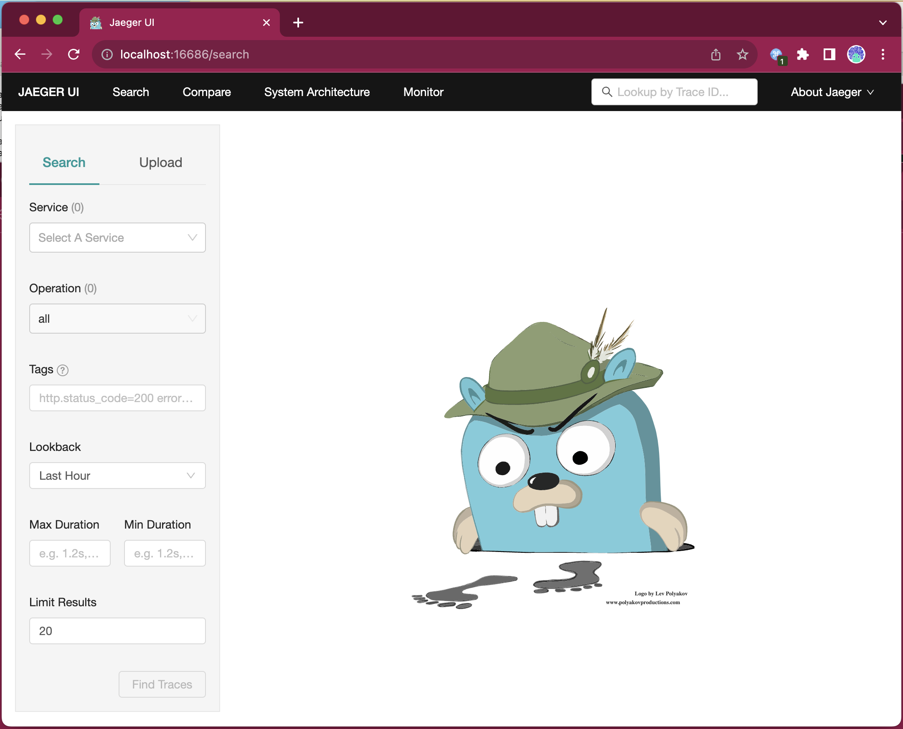
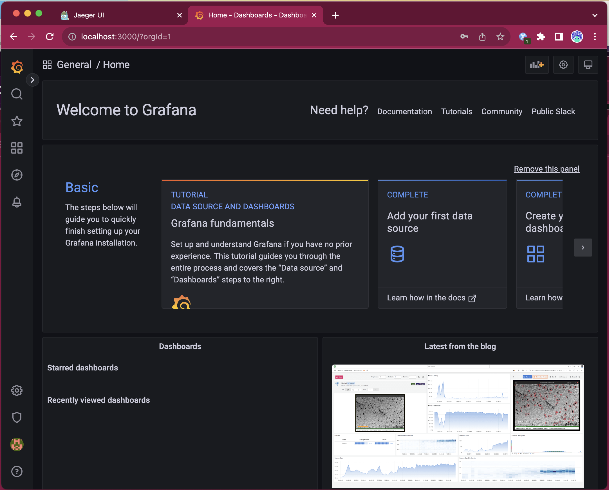
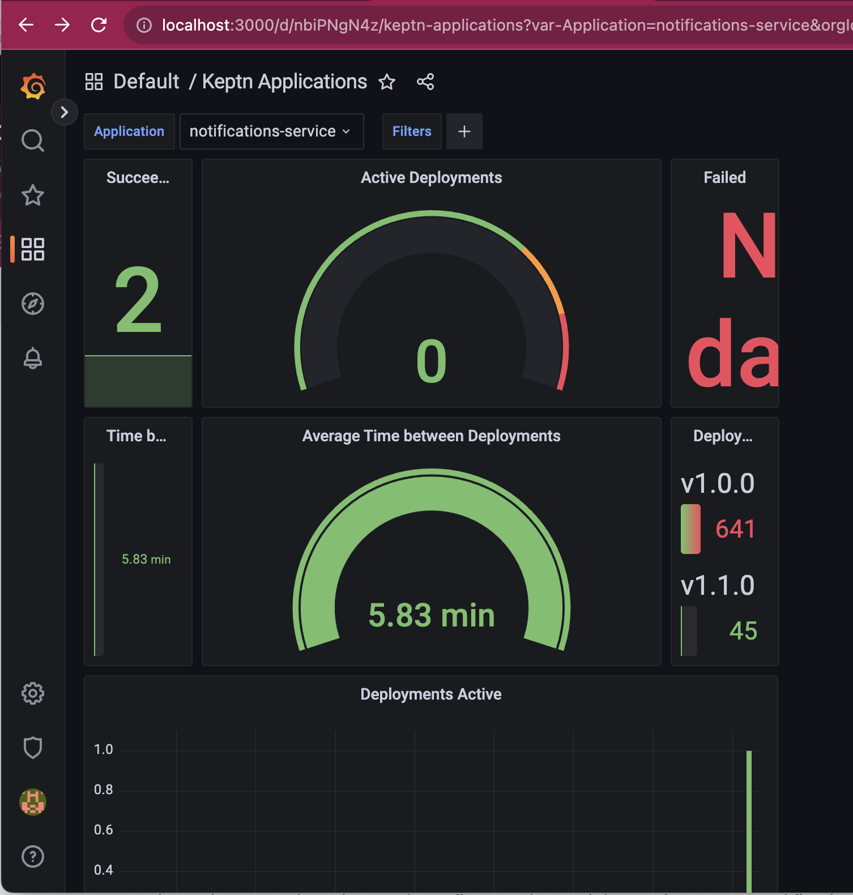
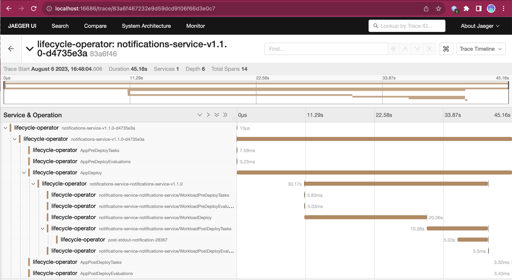

# Keptn 生命周期工具集的部署频率数据

本文介绍使用 Keptn 生命周期工具集监控、观察云原生应用程序的生命周期事件并作出反应。

## 安装

首先要有一个 Kubernetes 集群来安装 [Keptn KLT](https://keptn.sh)。可以参照第二章内容[部署一个 Kind 集群](../../chapter-2/README-zh.md)。

接下来就可以部署 Keptn 的生命周期工具包了。一般来说使用 Helm Chart 就可以完成了，但是在本教程中，我们还希望部署 Prometheus、Jaeger 以及 Grafana，这样才能有一个完善的 Dashboard。因此在 KLT Helm Chart 之外，我们还准备了一个 Makefile 来部署本文所需的所有工具。

运行: 

```shell
make install
```

**注意**：安装过程包含了几个工具，可能要花比较长的一段时间。

只要给被监控命名空间打上注解就可以让 KLT 对这个命名空间进行监控了：

```shell
kubectl annotate ns default keptn.sh/lifecycle-toolkit="enabled"
```

## Keptn 生命周期工具集上手

Keptn 根据 Kubernetes 注解来识别和监控我们的工作负载。

会议应用使用的 Deployment 使用了如下注解，例如议程服务：

```yaml
    app.kubernetes.io/name: agenda-service
    app.kubernetes.io/part-of: agenda-service
    app.kubernetes.io/version: {{ .Values.services.tag  }}
```

这些注解让工具能够获得工作负载的更多细节，例如这里的注解让工具了解到，服务名称是 `agenda-service`。可以使用 `app.kubernetes.io/part-of` 注解来把多个服务聚合为同一个应用。本例中，我们希望每个服务都是独立实体以便分别进行监控。

在这个示例中，我们还将使用 `KeptnTask`，以便在部署前和部署后执行任务。这里有个简单的 `KeptnTaskDefinition`：

```yaml
apiVersion: lifecycle.keptn.sh/v1alpha3
kind: KeptnTaskDefinition
metadata:
  name: stdout-notification
spec:
  function:
    inline:
      code: |
        let context = Deno.env.get("CONTEXT");
        console.log("Keptn Task Executed with context: \n");
        console.log(context);

```

正如您所看到的，该任务只是在执行过程中输出上下文，但在这里您可以建立与其他项目的集成或调用外部系统。如果查看 Keptn 的示例，你会发现 `KeptnTaskDefinition` 可用于集成 Slack、运行压力测试或验证部署后是否按预期运行。这些任务使用了 [Deno](https://deno.land/)，Deno 支持 Typescript 运行时、Python 3 或直接使用容器映像。

提交到集群：

```shell
kubectl apply -f keptntask.yaml
```

`KeptnTaskDefinitions` 让平台团队能够创建可复用的任务，这些任务可以用钩子的方式在部署前后运行。通过向我们的工作负载（本例中为部署）添加以下注解，Keptn 将在本例中执行部署后（以及任何更新后）自动执行 `stdout-notification`：

```shell
  keptn.sh/post-deployment-tasks: stdout-notification
```

部署会议应用，然后打开 Jaeger 和 Grafana Dashboard，在新的终端窗口中运行：

```shell
make port-forward-jaeger
```

用浏览器打开 [http://localhost:16686/](http://localhost:16686/)：



然后在新的终端窗口中执行：

```shell
make port-forward-grafana
```

用浏览器打开 [http://localhost:3000/](http://localhost:3000/)，用 `admin/admin` 登录，你会看到：



现在，让我们按照第二章的方法部署会议应用程序：

```shell
helm install conference oci://registry-1.docker.io/salaboy/conference-app --version v1.0.0
```

检查 Jaeger 和 Grafana Keptn 的 Dashboard，默认情况下 Keptn 工作负载会跟踪部署频率。

在 Grafana 中进入 `Dashboards` -> `Keptn Applications`，会看到一个下拉菜单，这里可以选择不同的应用程序服务。选中 Notification 服务。由于我们只部署了部署的第一个版本，所以可看的东西不多，但发布新版本，仪表板开始有意思了。

例如，编辑 Notificaiton 的部署，更新 `app.kubernetes.io/version` 注解，使其值为 `v1.1.0`，并将容器镜像的 Tag 更新为 `v1.1.0`：

```shell
kubectl edit deploy conference-notifications-service-deployment
```

执行更改后，新版本已启动并运行，再次查看 Dashboard。

在 Grafana 中会到第二次部署已经成功，在环境中，两次部署之间的平均间隔为 5.83 分钟，`v1.0.0`耗时 641 秒，而 `v1.1.0` 仅耗时 40 秒。这肯定还有改进的余地。



查看 Jaeger 中的跟踪记录，就会发现 Keptn 的核心组件之一 `lifecycle-operator` 正在监控我们的部署资源并执行生命周期操作，例如调用部署前和部署后任务。



这些任务以 Kubernetes Jobs 的形式，在运行工作负载的同一命名空间中执行。你可以通过跟踪 Job Pod 的日志来查看这些任务的日志。

```shell
kubectl get jobs
NAME                                   COMPLETIONS   DURATION   AGE
post-stdout-notification-25899-78387   1/1           3s         66m
post-stdout-notification-28367-11337   1/1           4s         61m
post-stdout-notification-54572-93558   1/1           4s         66m
post-stdout-notification-75100-85603   1/1           3s         66m
post-stdout-notification-77674-78421   1/1           3s         66m
post-stdout-notification-93609-30317   1/1           3s         23m
```

在部署执行更新后，执行了 ID 为 `post-stdout-notification-93609-30317` 的作业。

```shell
> kubectl logs -f post-stdout-notification-93609-30317-vvwp4
Keptn Task Executed with context: 

{"workloadName":"notifications-service-notifications-service","appName":"notifications-service","appVersion":"","workloadVersion":"v1.1.0","taskType":"post","objectType":"Workload"}

```

## 下一步

教程中所看到的只是基础知识，强烈建议读者进一步熟悉 Keptn 生命周期工具包的特性和功能。请参考 [KeptnApplication](https://lifecycle.keptn.sh/docs/concepts/apps/) 的概念，看看 Keptn 对服务版本部署过程的的细粒度规则。

使用 `app.kubernetes.io/part-of` 注解能将多个服务作为同一个 Kubernetes 应用程序的一部分进行分组，就可以对一组服务执行前置和后置操作，从而不仅可以验证单个服务是否按预期运行，还可以验证整组服务是否按预期运行。
